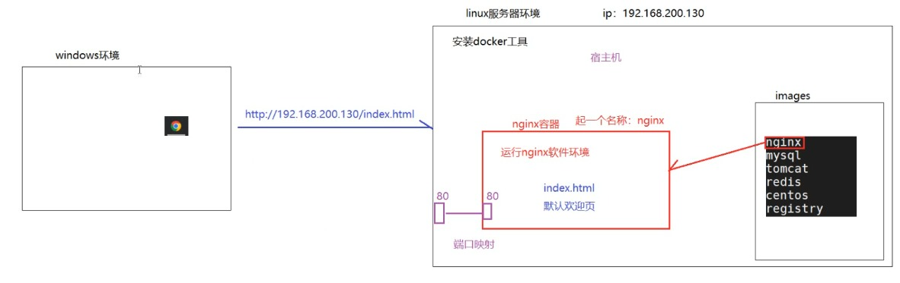
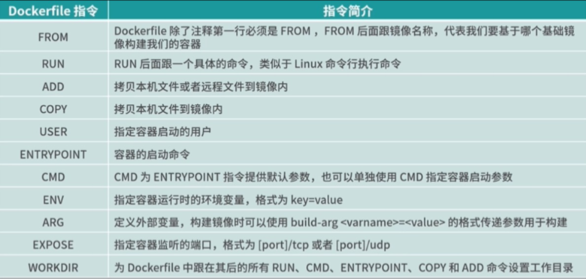
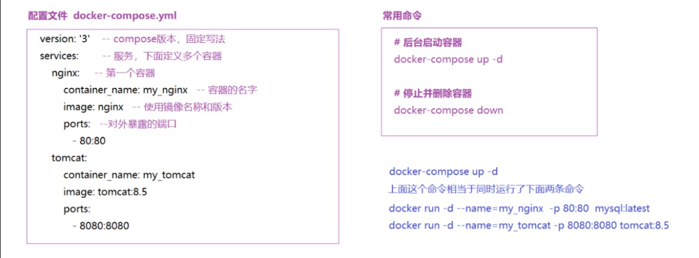

# Docker

> 镜像，容器，数据卷

## 什么是Docker？
官网解释：
Docker是一组平台即服务（PaaS）的产品。它基于操作系统层级的虚拟化技术，将软件与其依赖项打包为容器。托管容器的软件称为Docker引擎。
Docker能够帮助开发者在轻量级容器中自动部署应用程序，并使得不同容器中的应用程序彼此隔离，高效工作

可以这么理解：  
项目运行需要运行软件，假如a系统装了软件的函数库和依赖库，b系统上面可能不支持，不兼容，为了解决差异化和不兼容，我们可以把函数库和依赖库放在一个容器中，
一起放在系统内核中运行，系统版本都会依赖系统内核，直接在内核中运行，就解决了差异化和不兼容问题，而这个落地技术就是Docker！
## 包含两部分
镜像：把程序需要的依赖库，函数库，环境配置等文件放在一起，就叫做镜像，类似于安装包

容器：从镜像中拿出来运行的进程就是容器，一个镜像可以运行多个容器，类似于运行环境
## 下载安装：
DockerHub (镜像托管平台，但是是国外了，访问下载有点慢)，我们可以用国内的镜像，比如阿里云镜像库，网易云镜像服务等
~~~
1：yum 包更新到最新 
yum update
2：安装需要的软件包， yum-util 提供yum-config-manager功能，另外两个是devicemapper驱动依赖的 
yum install -y yum-utils device-mapper-persistent-data lvm2
3: 设置yum源
yum-config-manager --add-repo https://mirrors.aliyun.com/docker-ce/linux/centos/docker-ce.repo
sed -i 's/download.docker.com/mirrors.aliyun.com\/docker-ce/g' /etc/yum.repos.d/docker-ce.repo
yum makecache fast
4: 安装docker，出现输入的界面都按 y 
yum install -y docker-ce
5: 查看docker版本，验证是否验证成功
docker -v
6: 启动docker环境
systemctl start docker
7: 设置开机自启动
systemctl enable docker
~~~
## 配置镜像：
默认情况下都是从dockerhub官网下载镜像 https://hub.docker.com/ 但是太慢，所以这里我们用国内的

创建或修改 /etc/docker/daemon.json 文件，可以用第一个，也可以用第二个
~~~
中国科技大学镜像地址
{
 "registry-mirrors":["https://docker.mirrors.ustc.edu.cn"]
}

网易云镜像地址
{
 "registry-mirrors":["http://hub-mirror.c.163.com"]
}

阿里云镜像,需要自己手动生成的加速地址:https://cr.console.aliyun.com/

然后重启Docker
systemctl restart docker

查看是否成功
docker info
~~~
## 常用镜像命令：
~~~
查看本地镜像 
docker images

搜索镜像仓库，推荐：https://hub.docker.com/
docker search 镜像名称

下载（拉取）镜像，镜像名称格式为 名称:版本号
docker pull 镜像名称

删除镜像
docker rmi 镜像名称
~~~
## 容器是什么？
容器你可以当作一个网站。访问需要有名字，有地址，你现在想要访问，我们就需要先从镜像中取出来一个，放在容器中来运行，

容器要放在宿主机上运行，什么是宿主机呢？你可以理解为一个小区，小区就是宿主机，每栋楼就是容器，想要访问需要先找到小区地址，再找到对应的楼号

端口映射就是楼号对应小区，80默认可以不用写
## 怎么运行容器
~~~
查看本地容器
docker ps 	  # 能查看正在运行
docker ps -a  # 能查看所有的容器（运行的和停止的）

创建一个新的容器并运行(-d  后台运行容器，并返回容器ID  -p 主机端口:容器端口  指定映射关系)
docker run -d -p 主机端口:容器端口 --name=容器名 镜像名称
这里就是运行容器，-d是再后台运行，-p就是映射，然后--name= 是给容器起个名字 然后根据镜像来创建
比如创建nginx
docker run -d -p 80:80 --name=nginx nginx:latest  后面latest是指定哪个版本，不写就默认是最新的

进入容器内部
docker exec -it 容器名称 bash

启动容器
docker start 容器名称

查看容器日志
docker logs 容器名称

停止容器
docker stop 容器名称

# 删除容器
docker rm [-f] 容器名称
~~~
### 部署mysql：
~~~
# 创建并启动容器，-e是指定环境，密码是root，然后反斜杠\是换行，要不然直接回车就执行了。
docker run -d -p 3306:3306 --name=mysql -e MYSQL_ROOT_PASSWORD=root mysql:5.7 \   下面是设置字符集为utf-8
--character-set-server=utf8mb4 --collation-server=utf8mb4_unicode_ci

# 操作容器中的mysql
docker exec -it mysql /bin/bash
~~~
### 部署tomcat：http://端口号:8080/index.html
~~~
# 创建并启动容器
docker run -d --name=tomcat -p 8080:8080 tomcat:8.5

#因为tomcat默认没有欢迎页，所以我们在本地模拟一个项目(创建一个hello目录,然后向目录中输出一个文件index.html,内容为hello world)
mkdir -p /root/tomcat/webapps/ROOT
echo "hello world" > /root/tomcat/webapps/ROOT/index.html

# 从宿主机复制文件到容器(docker cp 宿主机路径 容器名称:容器路径)
docker cp /root/tomcat/webapps/ROOT tomcat:/usr/local/tomcat/webapps/

# 操作容器中的tomcat
docker exec -it tomcat /bin/bash
~~~
### 部署Redis：
~~~
# 创建并启动容器
docker run -d --name=redis -p 6379:6379 redis:5.0

# 操作容器中的redis
docker exec -it redis /bin/bash
~~~
### 如果里面容器被删了，那么数据也会被删，所以这里我们把数据设置为持久化
可以用数据卷：数据卷就是一个磁盘目录，存在宿主机，将来你这个数据卷放啥， 容器中就会同步更新。想要同步就需要再创建容器的时候挂载这个数据卷
~~~
# 创建启动容器时，使用 –v 参数 设置数据卷
docker run ... –v 宿主机目录(文件):容器内目录(文件) ...
# 在/root目录下创建tomcat目录用于存储tomcat数据信息
mkdir -p /root/tomcat/webapps

# 创建容器，设置端口映射、目录映射
# docker run ... –v 宿主机目录(文件):容器内目录(文件) ...
docker run -d --name=tomcat1 -p 8081:8080 -v /root/tomcat/webapps:/usr/local/tomcat/webapps tomcat:8.5

docker run -d --name=tomcat2 -p 8082:8080 -v /root/tomcat/webapps:/usr/local/tomcat/webapps tomcat:8.5
~~~
### 注：
镜像都是按照层次来存放的，比如a镜像有1，2，3，4 层。假如我们要再下载b镜像，3，4，5，6，这里我们可以看到都有a已经有3和4了，我们就下载b的时候就不需要再下载一样的了，直接用a镜像的3和4就可以了

删除镜像的时候要先关闭运行中的容器
### 怎么自己制作镜像呢？

~~~
比如把我们自己的springboot jar包上传。先把我们的jar包放在linux root文件夹下，然后再同一层创建一个`springboot-dockerfile`文件，写上指令

# 定义基础镜像（从哪个镜像的基础上开始做）
FROM java:8 
# 定义作者信息（可以省略）
MAINTAINER  itheima <itheima@itcast.cn>
# 将jar包添加到容器，并改名为app.jar
ADD springboot-hello-0.0.1-SNAPSHOT.jar app.jar
# 镜像启动容器的时候，执行的命令
CMD java -jar app.jar
~~~
然后我们通过dockerfile构建镜像
~~~
# -f :指定要使用的Dockerfile路径   -t :指定生成的镜像名称   .  镜像构建过程中的上下文环境的目录 	
docker build -f ./springboot-dockerfile -t app-itheima .
~~~
查看生成的镜像，并运行容器
~~~
docker images
docker run -d -p 18080:8080 app-itheima:latest
~~~
把镜像变成压缩包：
~~~
# 1、将镜像进行压缩（制作压缩包不能使用iamgeID）
docker save -o 压缩文件名称 镜像名称:版本号
比如打包我们上面的app-itheima  -o是指定压缩文件的名字，注意后面指定镜像名称不能用iamgeID，要不然解压后没有名字了。。。
docker save -o heima.tar app-itheima

# 2、解压文件获得镜像
docker load –i 压缩文件名称
~~~
以后开发的时候，需要多个容器同时运行，我们还要一个一个创建容器，太浪费时间，所以这里用一个工具
~~~
# 安装docekr compose 工具
curl -L https://github.com/docker/compose/releases/download/1.22.0/docker-compose-`uname -s`-`uname -m` -o /usr/local/bin/docker-compose

# 设置权限
chmod +x /usr/local/bin/docker-compose

# 查看版本 
docker-compose -version
~~~
然后我们可以把需要创建运行的容器写在一个配置文件中，通过命令来管理

首先我们先创建一个目录
~~~
mkdir ~/docker-compose
cd ~/docker-compose
~~~
然后再创建一个`docker-compose.yml`文件，同时我们配置的时候可以挂载文件
~~~
version: '3'
services: 
  nginx:
   container_name: my_nginx
   image: nginx
   ports:
    - 80:80
  tomcat:
   container_name: my_tomcat
   image: tomcat:8.5
   ports:
    - 8080:8080    
   volumes: //这里挂载数据卷
    - /root/tomcat/webapps:/usr/local/tomcat/webapps
  redis:
   container_name: my_redis
   image: redis:5.0
   ports:
    - 6379:6379      
~~~
之前创建了容器，这里我们先删除
~~~
# 删除所有容器
docker rm -f `docker ps -aq`
# 这个也可以删除容器，执行此命令的时候，需要和配置文件在同一个目录下
docker-compose down

# 然后执行命令,启动容器
# 执行此命令的时候，需要和配置文件在同一个目录下
docker-compose up -d
~~~

