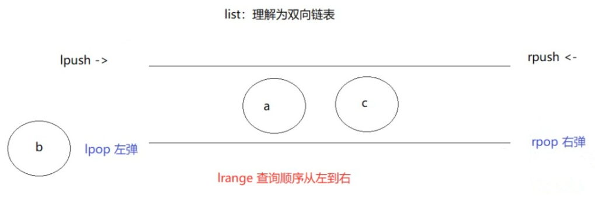
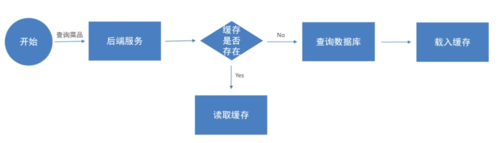

# Redis
> redis是一个基于内存的key-value结构的NoSQL数据库,默认端口号6379
## 开始
**NoSQL:** 关系型数据库是数据库和数据库之间存在关系，但是存在磁盘上，读写数据比较差。而NoSQL是非关系型数据库，意思是不要SQL，也就是不用sql，而是用 API 或专用命令，格式比较灵活，比如redis就是用的键值对，存储在内存条上
## Redis数据类型
注:redis里面的null是nil
#### 字符串String
~~~
新增：set key value   如果value有空格，要用引号引起来
查询：get key
删除：del key
新增的时候设置过期时间： setex key 过期时间 value
查看剩余时间：ttl key
根据键判断记录是否存在：exists key
新增的时候判断是否存在：setnx key value
自增/减操作：incre/decr key
~~~
#### 哈希(大的map套一个小map)
~~~
新增：hset key hkey hvalue     hset 大键 小键 值  可以理解为把键值对存到一个大键中
查询：所有 hgetall key
	 单个 hget key hkey
获取所有hkey（小键）: hkeys key
获取所有hvalue: hvals key
删除： 单个 hdel key hkey
	  所有 del key
修改就是覆盖，直接新增原来的名字就可以
~~~
#### 列表list（有序且重复）是一个双向链表，添加的时候是可以从头添加，也可以从尾添加，但查询的时候只能从左开始查询

~~~
新增：左压 lpush key value
     右压 rpush key value
查询元素：
    lrange key [开始索引 结束索引]  最后一个索引是-1
查询列表长度： llen key
删除元素； 左弹 lpop key
    	 右弹 rpop key
~~~
#### 集合set（hash表，无序，不可重复）
~~~
新增： sadd key value
查询元素： smembers key
查询集合数量：scard key
删除元素：srem key value
  比如添加小明的爱好： asdd ming it music sport
   添加小红的爱好： asdd hong it music tiaowu
求集合的交集： sinter key1 key2
    比如查小明和小红共同的爱好（交集）： sinter ming hong   结果就是  it music
求集合的并集： sunion key1 key2
    同上查询全部的爱好（并集）：sunion ming hong    结果 it music sport tiaowu
~~~
##### 有序集合zset（有序，不可重复）
~~~
新增： zadd key score value    score是分数，指定分数会按照分数排序
查询：
    升序 zrange key start end [withscores]
    降序 zrevrange key start end [withscores]
   比如新增语文成绩排名：
    zadd yuwen 81 ming
    zadd yuwen 86 hong
加分: zincrby key increment member
    比如小明语文加10分： zincrby yuwen 10 ming
删除： zrem key value  
~~~
## 通用命令
模糊查询键
~~~
keys *
~~~
删除多个键
~~~
del key key ...
~~~
根据键判断值类型
~~~
type key
~~~
选择数据库： 默认有16个数据库
~~~
select 0~15
~~~
## 用java操作Redis
Spring对Redis进行了整合，提供了Spring Data Redis，它将所有的类型命令封装到了一个类中，名字叫: RedisTemplate
导入坐标：
~~~
<dependency>
    <groupId>org.springframework.boot</groupId>
    <artifactId>spring-boot-starter-data-redis</artifactId>
</dependency>
~~~
添加redis配置：
~~~
sky:
  redis:
    host: localhost
    port: 6379
    password: itheima

spring:
  redis:
    host: ${sky.redis.host}
    port: ${sky.redis.port}
    password: ${sky.redis.password}
~~~
如果要让一个java对象存到Redis内存中，必须要实现序列化接口！
~~~
实体类 implements Serializable
~~~
字符串
~~~
 //字符串类型
ValueOperations valueOperations = redisTemplate.opsForValue();
//存
valueOperations.set("小明", 18);
//取
valueOperations.get("小明");
//存短信验证码，5分钟有效时间
valueOperations.set("手机号:111","1024", Duration.ofSeconds(300));
//存java对象
Category category = new Category();
category.setName("羽毛球");
valueOperations.set("对象",category);
//取java对象
valueOperations.get("对象");
~~~
列表
~~~
//列表操作对象
ListOperations listOperations = redisTemplate.opsForList();
// 左压入
listOperations.leftPushAll("泡泡","a","b","c");
// 查询    c b a
List mylist = listOperations.range("泡泡", 0, -1);
System.out.println(mylist);
// 右弹出
System.out.println(listOperations.rightPop("泡泡"));
// 查询  c b
List mylist1 = listOperations.range("泡泡", 0, -1);
System.out.println(mylist1);
~~~
哈希
~~~
 //哈希类型
HashOperations hashOperations = redisTemplate.opsForHash();
//存
hashOperations.put("大key","小key","值");
hashOperations.put("语文","小明",89);
hashOperations.put("语文","小红",99);
//取一个
hashOperations.get("语文", "小明");
//取所有
Set hkeys = hashOperations.keys("语文");
for (Object key : hkeys) {
    hashOperations.get("语文", key);
}
~~~
集合
~~~
//集合操作对象
SetOperations setOperations = redisTemplate.opsForSet();
// 存 蔡徐坤
// setOperations.add("caixukun","唱","跳","rap","打篮球");
// 存 
// setOperations.add("ming","爱坤","唱","rap");
// 查询
Set set = setOperations.members("ming");
System.out.println(set);
// 交集
System.out.println(setOperations.intersect("caixukun", "ming"));
// 并集
System.out.println(setOperations.union("caixukun", "ming"));
// 删除
setOperations.remove("caixukun","rap");
~~~
有序集合
~~~
// 有序集合操作对象
ZSetOperations zSetOperations = redisTemplate.opsForZSet();
// 存
// zSetOperations.add("语文","后羿",66.4);
// zSetOperations.add("语文","安其拉",45.2);
// zSetOperations.add("语文","妲己",23.2);
// 安其拉买了皮肤，+ 30攻击力
zSetOperations.incrementScore("语文","安其拉",30);
// 查询 降序
System.out.println(zSetOperations.reverseRange("语文", 0, -1));
~~~
公共代码
~~~
// 查询c开头的  keys c*
Set keys = redisTemplate.keys("c*");
System.out.println(keys);
// 批量删除
redisTemplate.delete(keys);
// 判断key是否存在
System.out.println(redisTemplate.hasKey("caixukun"));
~~~
## 案例：后台管理端有个营业中和打烊中，只要一个1和0的值，存sql数据库比较多余，所以这里可以存储到Redis
前端需要一个1或者0，我们通过键存储值，前端设置店铺状态为打烊就会传过来一个1，然后我们通过Redis存储到Redis数据库中。然后查询店铺状态的时候，从Redis中获取到值返回即可
小程序端要同步的话，同样从Redis中获取值返回即可
## 在高并发的情况下，频繁查询会使数据库性能下降，我们可以对其进行优化，添加缓存功能：
适合经常访问但不经常修改的数据放在Redis中比较优~
把即将查询到的数据保存到Redis中，在数据库不变化的情况下，后面的查询从Redis中读取数据，就能提高查询性能

用户访问过一次后，会去sql数据库查询数据，之后把查询到的数据保存到到Redis缓存，下次用户再查询的时候，会从Redis缓存中获取数据，提高性能
~~~
@Autowired //调用service查询数据库
 private DishService dishService;

 @Autowired 调用Redis
 private RedisTemplate redisTemplate;

 // 根据分类id查询菜品列表（小程序段）
 @GetMapping("/list")
 public Result getList(@RequestParam Long categoryId) {
     //代码从上往下执行
     List<DishVO> voList = null;
     // ---------------------start
     // 先查询redis中是否有该分类的菜品缓存
     String dishKey = "DISH:" + categoryId;
     if (redisTemplate.hasKey(dishKey)) { //如果有值，则代表有数据
         log.info("查询缓存...");  //然后查询Redis中的缓存数据
         voList = (List<DishVO>) redisTemplate.opsForValue().get(dishKey);
         return Result.success(voList); //返回Redis中的缓存数据
     }
     // ---------------------end
     // 封装dto条件
     DishPageDTO dishPageDTO = DishPageDTO.builder()
             .categoryId(categoryId)
             .status(1)
             .build();
     // 调用service查询,返回结果
     log.info("查询数据库...");
     voList = dishService.getParamList(dishPageDTO);
     // --------------------------  start
     // 将数据库数据同步到缓存，从数据库查询到的数据存到缓存
     redisTemplate.opsForValue().set(dishKey, voList);
     // --------------------------  end
     return Result.success(voList); //返回从数据库查询到的数据
 }
~~~
## 如果修改了数据库的数据，但用户访问的时候还是读取的缓存，会出现脏读，我们必须保持数据一致性
我们需要在新增，修改，删除的时候清理缓存，在执行完操作后清理缓存,我们id是从菜品分类id中获取的，所以通过菜品分类id清理就可以了
~~~
redisTemplate.delete("DISH:"+dishDTO.getCategoryId());
~~~
修改菜品的时候，有可能会改，有可能不会改，所以为了保险起见，我们直接把修改的所有缓存都清理
~~~
Set dishKey = redisTemplate.keys("DISH*"); //只要是这个开头的，都清理，而不是根据id清理了
redisTemplate.delete(dishKey);
~~~
同时批量删除的时候前端只传了菜品的id，没有传分类id，所以这里我们也需要全部清理缓存

