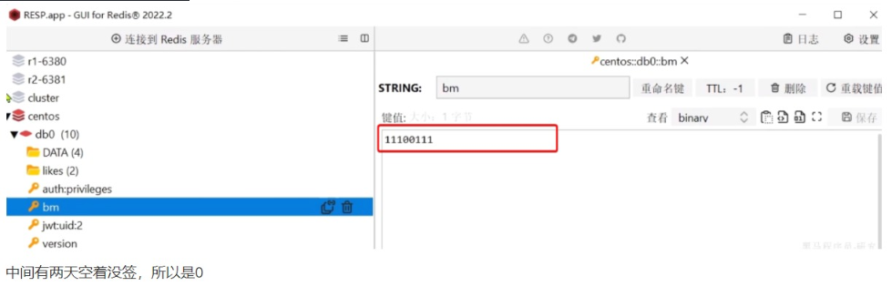
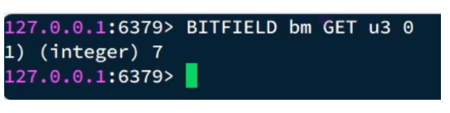
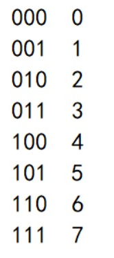
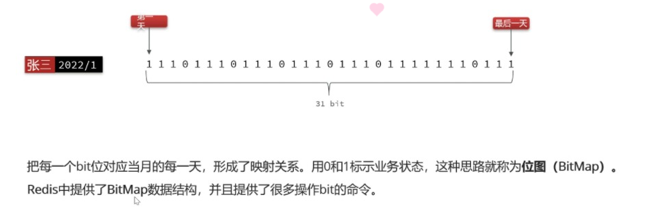

# 位图

>位图，即大量bit组成的一个数据结构(每个bit只能是0和1)，主要适合在一些场景下，进行空间的节省。
它是一个字符串类型的数据结构，实际上是对字符串的每个比特位进行操作。
例如一些大量的bool类型的存取，一个用户365天的签到记录，签到了是1，没签到是0，如果用普通的key/value进行存储，当用户量很大的时候，需要的存储空间是很大的。
在 Redis 的位图中，每个位可以设置为 0 或 1，并且可以将多个位组合在一起形成一个按位存储的数据结构。位图的长度是动态可变的，最大支持 2^32 - 1 个比特位。
使用位图可以实现一些常见的应用场景，例如：
统计用户的访问次数或活跃度。
进行布隆过滤器（Bloom Filter）等高效的数据结构的实现。
压缩和存储稀疏的布尔数据。
实现位图索引，用于高效地进行集合操作，如交集、并集和差集。

## BitMap用法
• [相关操作命令](https://redis.io/docs/latest/commands/?group=bitmap/)

SETBIT key offset value：将指定偏移量 offset 处的位设置为给定的值 value（0 或 1）。
GETBIT key offset：获取指定偏移量 offset 处的位的值。
BITCOUNT key [start end]：计算给定范围内（默认整个位图）的位为 1 的数量。
BITOP operation destkey key [key …]：对多个位图执行逻辑操作（AND、OR、NOT、XOR），并将结果存储到目标位图 destkey 中。

例如，修改某个bit位上的数据：
~~~
offset：要修改第几个bit位的数据
value：0或1
如果要签到就可以利用上面的这个命令，例如这个月的第1、2、3、6、7、8几天签到了，就可以这样：
# 第1天签到
SETBIT bm 0 1
# 第2天签到
SETBIT bm 1 1
# 第3天签到
SETBIT bm 2 1
# 第6天签到
SETBIT bm 5 1
# 第7天签到
SETBIT bm 6 1
# 第8天签到
SETBIT bm 7 1
~~~

最终Redis中保存的效果：
> 

那如果我们要查询签到记录怎么办？
那就是要读取BitMap中的数据，可以用这个命令，这个命令比较复杂，是一个组合命令，可以实现查询、修改等多种操作。不过我们只关心读取，所以只看第一种操作，GET即可:
~~~
BITFIELD key GET encoding offset
~~~
- key：就是BitMap的key  
- GET：代表查询  
- encoding：返回结果的编码方式，BitMap中是二进制保存，而返回结果会转为10进制，但需要一个转换规则，也就是这里的编码方式  
- u：无符号整数，例如 u2，代表读2个bit位，转为无符号整数返回  
- i：有符号整数，例如 i2，代表读2个bit位，转为有符号整数返回  
- offset：从第几个bit位开始读取，例如0：代表从第一个bit位开始  

例如，我想查询从第1天到第3天的签到记录，可以这样：


可以看到，返回的结果是7. 为什么是7呢？

签到记录是 11100111，从0开始，取3个bit位，刚好是111，转无符号整数，刚好是7



## 签到案例
如果我们签到的话，保存到数据库需要多条数据。数据量多了的话就比较占用内存，所以这里我们可以优化一下，签到为1，没签到为0，只需要用1或者0来记录即可，Redis中提供了用二进制来存储的办法，BitMap结构，大概意思就是你存的时候，我用二进制来从左往右存，取的时候转换为十进制的数

我们用java取的时候，如果要查看连续签到几天，比如11010111，后面三个1是连续签到的，我们需要先把十进制转换为二进制，然后转换为字符串，之后反转，遇到第一个0就结束，然后就能知道是连续签到几天了


### 计算连续签到天数
```
 String key = 签到记录的key的前缀，比如sign:uid:110:202301
                + userId
                + now.format(DateUtils.SIGN_DATE_SUFFIX_FORMATTER);//当前日期格式化
// 计算offset（哪一天，获取当前时间角标，需要-1）
int offset = now.getDayOfMonth() - 1;
// 2.计算连续签到天数
int signDays = countSignDays(key, now.getDayOfMonth());
//方案一
   // 1.获取本月从第一天开始，到今天为止的所有签到记录
   List<Long> result = redisTemplate.opsForValue()
           .bitField(key, BitFieldSubCommands.create().get(
                   BitFieldSubCommands.BitFieldType.unsigned(len)).valueAt(0));
   if (CollUtils.isEmpty(result)) {
       return 0;
   }
   //方案一
   //获取到里面的结果，但是现在是十进制的
   Long aLong = result.get(0);
   //转成字符串
   String string = Integer.toBinaryString(aLong.intValue());
   //如果前面都是0，那么转成二进制的话，就都是1111了，前面0就没有了
   //原来的值——补多长（总共多少位）——补什么
   String s = StrUtil.padPre(string, len + 1, "0");
   //反转
   String reverse = StrUtil.reverse(s);
   int days = reverse.indexOf("0");
   if (days == -1) {
       return len;
   }
   return days;

//方案二
 // 1.获取本月从第一天开始，到今天为止的所有签到记录
    int num = result.get(0).intValue();
    // 2.定义一个计数器
    int count = 0;
    // 3.循环，与1做与运算，得到最后一个bit，判断是否为0，为0则终止，为1则继续
    while ((num & 1) == 1) {//判断最低位是否为1
        // 4.计数器+1
        count++;
        //在每次循环中，变量 num 会右移 1 位，也就是将其二进制表示向右移动一位，丢弃最低位，倒数第二位成为新的最低位。
        // 5.把数字右移一位，最后一位被舍弃，倒数第二位成了最后一位
        num >>>= 1;
    }
    return count;
```


