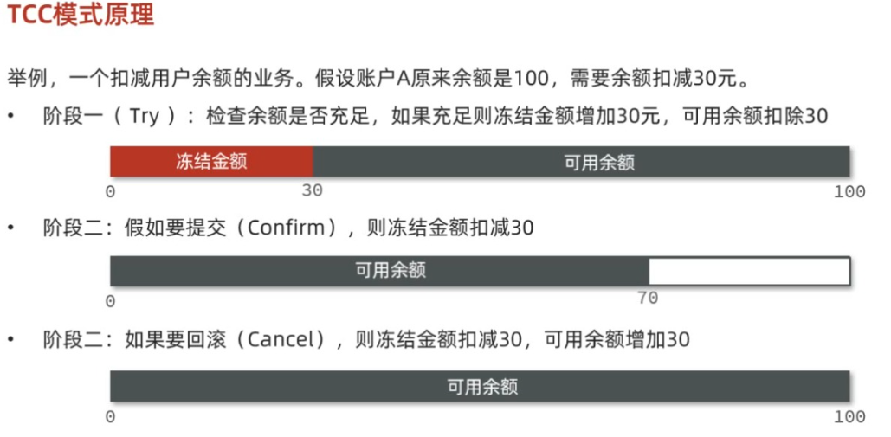
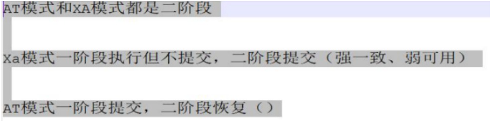
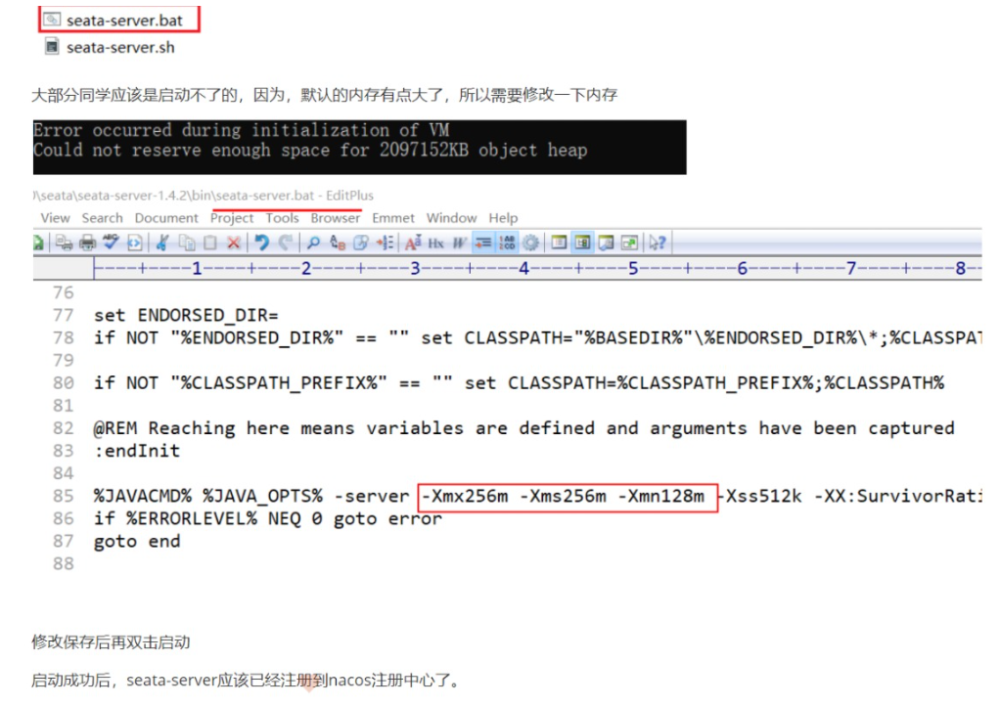
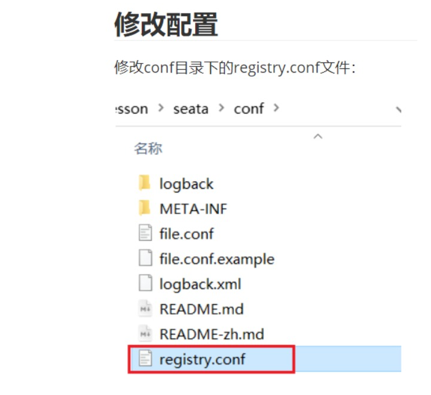
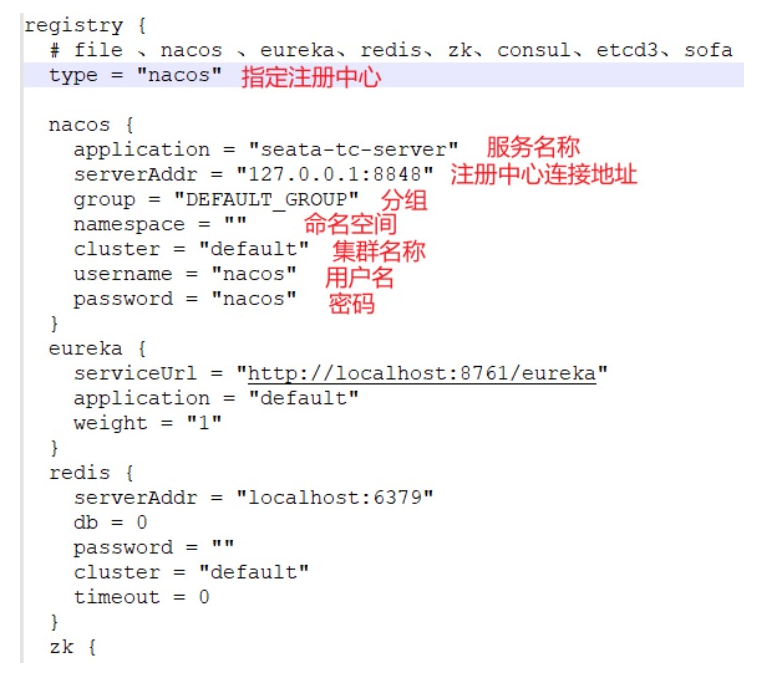
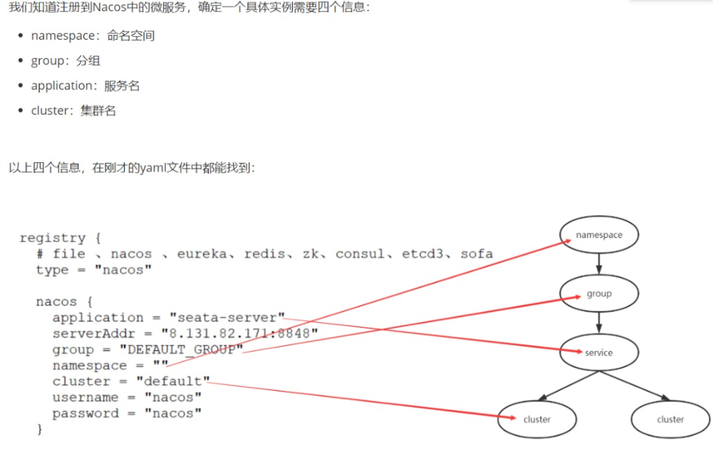

# 分布式事务

> CAP定理、BASE理论、AC/PC模式、Seata

## 事务
事务就是要保证一组数据库操作，要么全部成功，要么全部失败!

### 事务的ACID原则：
原子性：事务中的操作，要么全部成功，要么全部失败

一致性：事务执行前后，数据要保持一致

隔离性：多个事务之间操作互不影响

持久性：一个事务一旦提交成功，那么它对数据库的改变就是永久性的

分布式系统一致性：就是一次大的操作由不同的小操作组成，这些小的操作分布在不同的服务器上，且属于不同的应用，分布式事务需要保证这些小操作要么全部成功，要么全部失败。本质上来说，分布式事务就是为了保证不同数据库的数据一致性。

### 什么是分布式事务？
分布式事务是指在分布式系统中，涉及到不同节点或者不同的数据库的操作时，需要保证这些操作可以全部提交或者全部回滚，以保障数据的一致性和完整性。

### 分布式事务的CAP定理是什么？
一致性，可用性，分区容错性 这三个不能同时存在

一致性：用户访问分布式系统中的任意节点，得到的数据必须一致。可以理解为你去建设银行a存钱，去建设银行b取钱，查到的余额必须都是一样的。
可用性：用户访问集群中的任意节点，必须得到响应，而不是超时或拒绝。可以理解为你去银行b取钱，可以查，但是银行b还没有同步你在银行a存钱的信息，所以查到的数据不准确
分区容错性：分成两个来说
分区：就是说你在建设银行a存钱了，在银行b可以查到，但银行c没有同步到你存钱的消息，这样就造成了分区。
容错：在出现分区的时候，整个系统也要持续对外提供服务。可以理解为c虽然没有同步到你存钱的消息，但他银行c没有关门，还支持你查询余额，但是结果不准确
### 为什么分区一定出现的话，一致性和可用性只能用一个：
在项目中，查每个微服务，肯定会出现故障导致分区一定会出现，这样的话，如果我要保证可用性，就是每个银行都可以查余额，就会出现可能同步不过来导致数据不一致，自然也就做不到上面的一致性。
如果我要保持一致性，那么就要数据准确，而可用性就必须等待数据同步过来再响应。可以理解为你如果一定要在建设银行b查你存的钱，你就需要等建设银行a同步过来数据才可以。
### 什么是BASE理论？
类似中庸，主要包含三个思想。

基本可用：系统出现故障时，允损失部分可用性，即保证核心可用。

软状态：在一定时间内，允许出现中间状态，比如临时的不一致状态。

最终一致性：虽然无法保持强一致性，但是在软状态结束后，最终达成数据一致。

### AP模式和CP模式的区别?
ap是可用性可分区，允许最后查询结果不一致，最后采取措施恢复即可，但我还可以用。可以理解为可以取钱，但取的钱是之前余额的，而不是刚存的。

cp是一致性可分区。必须要强一致，但不一定能用。可以理解为能查出余额，但取不出钱。

### 什么是分支业务？什么是全局事务？
每个微服务都是分支业务，有关联的各个分支事务在一起称为全局事务。而我们需要控制全部业务来完成事务要么全部成功，要么全部失败，这个就叫做事务协调者。

### 既然不能同时实现，只能实现AP或CP，那么用哪个技术来实现呢？
**Seata**

RM（控制微服务的分支事务）学生：用来管理分支事务

TC（事务协调者）班长：记录每个分支事务（RM）的执行情况

TM（全局事务）老师：控制事务是提交还是回滚

可以理解为三个角色：老师告诉班长，有比赛需要报名，然后班长告诉学生，有比赛需要报名，学生可以根据自身情况告诉班长，自己要不要报名，之后班长统计后告诉老师

### Seata提供的四种分布式事务解决方案都是什么？
早期XA模式：CP，强一致性，分为两个阶段，第一阶段是由班长(TC)告诉学生(RM)可以开始考试了，然后学生告诉班长，没问题，我们开始准备，考完的就只要告诉班长考完了就可以，先不交卷子。二阶段就是班长通知学生，你们可以提交你们的卷子了。如果一阶段只要有一个学生告诉班长，我考试失败了，那么第二阶段，班长就会告诉其他学生，不用交卷子了。因为需要一致性。

SeataXA模式：CP，强一致性，也是分为两个阶段，第一阶段是老师（TM）先告诉班长要考试了，然后老师直接告诉学生(RM)可以开始考试了，之后学生考完了或者考试失败，都告诉班长(TC)。然后等老师(TM)告诉班长可以收卷子了(检查状态情况了),然后班长检查如果都考试成功，就提交，如果有考试失败，就回滚。

两个阶段，第一个阶段各自执行但不提交，把自己的执行结果上报给TC，TC记录后，第二阶段检查状态，如果都成功就提交，如果有一个失败就回滚。能够查到准确数据，但是等待期间不可用。

AT模式（默认模式）：AP，最终一致性，也就是可用性。两个阶段，和上面一样，第一阶段是老师（TM）先告诉班长要考试了，然后老师直接告诉学生(RM)可以开始考试了，学生先把自己卷子备份一份，之后学生考完了或者考试失败，都交卷子给班长(TC)，就可以离开了。最后等老师(TM)告诉班长可以收卷子了(检查状态情况了),然后班长检查如果都考试成功，就提交，然后把备份的卷子删了，如果有考试失败，就回滚。

第一阶段就是执行前拍个快照然后提交，不会占用数据库，然后TC检查是否都成功，如果成功了就删除快照即可，如果有一个失败，就回滚，把快照之前记录的再回滚到以前。能够使用，但数据不准确。（快照是一张表，Seata官方提供了）undo_log

TCC模式：非事务性数据库，比如Redis 以人工编码的模式来模拟AT

模拟快照，拍快照，删快照

代码执行：接口
~~~
@LocalTCC
public interface AccountTCCService {
    /**
     *  一阶段：try 预留
     *  @TwoPhaseBusinessAction 定义 try confirm cancel 方法名
     */
    @TwoPhaseBusinessAction(name = "deduct", commitMethod = "confirm", rollbackMethod = "cancel")
    void deduct(@BusinessActionContextParameter(paramName = "userId") Integer userId,
                @BusinessActionContextParameter(paramName = "money") Integer money);

    /**
     *  二阶段：confirm 提交
     * @param ctx 可以获得 @BusinessActionContextParameter参数和xid
     *
     */
    Boolean confirm(BusinessActionContext ctx);

    /**
     * 二阶段：cancel 回滚
     * @param ctx 可以获得 @BusinessActionContextParameter参数和xid
     *
     */
    Boolean cancel(BusinessActionContext ctx);
}
~~~
实现类：
~~~
@Autowired
private AccountMapper accountMapper;

@Autowired
private AccountFreezeMapper freezeMapper;

@Override
public void deduct(Integer userId, Integer money) {
    // 0.获取全局事务XID
    String xid = RootContext.getXID();
    
    // 解决业务悬挂
    AccountFreeze freezeOld = freezeMapper.selectById(xid);
    if (freezeOld!=null) {
        return;
    }

    // 1.拍摄快照
    AccountFreeze freeze = new AccountFreeze();
    freeze.setXid(xid);
    freeze.setUserId(userId);
    freeze.setFreezeMoney(money);
    freeze.setState(AccountFreeze.State.TRY);
    freezeMapper.insert(freeze);
    // 2.执行业务
    accountMapper.deduct(userId, money);
}

@Override
public boolean confirm(BusinessActionContext ctx) {
    // 1.获取全局事务XID
    String xid = ctx.getXid();
    // 2.根据xid删除快照
    freezeMapper.deleteById(xid);
    return true;
}

@Override
public boolean cancel(BusinessActionContext ctx) {
    // 1.获取全局事务XID
    String xid = ctx.getXid();
    // 2.查询快照
    AccountFreeze freeze = freezeMapper.selectById(xid);

    // 获取全局参数
    Integer userId = (Integer) ctx.getActionContext("userId");
    Integer money = (Integer) ctx.getActionContext("money");
    // 解决空回滚
    if (freeze == null) {
        freeze = new AccountFreeze();
        freeze.setXid(xid);
        freeze.setUserId(userId);
        freeze.setFreezeMoney(0);
        freeze.setState(AccountFreeze.State.CANCEL);
        freezeMapper.insert(freeze);
        return true;
    }

    // 解决幂等性问题
    if (freeze.getState() == AccountFreeze.State.CANCEL) {
        return true;
    }

    // 3.修改冻结金额为0，状态为2
    freeze.setFreezeMoney(0);
    freeze.setState(AccountFreeze.State.CANCEL);
    freezeMapper.updateById(freeze);

    // 4.恢复账户的钱
    accountMapper.refund(userId, money);
    return true;
}
~~~
### SAGA模式：
#### XA模式优点和缺点？
优点，强一致性，实现简单，没有代码侵入。缺点是性能比较差，如果微服务1执行完了，还需要等微服务100执行完才可以提交，锁定数据库的时候别人不能用，需要等二阶段结束才释放。不涉及敏感服务，比如钱转账，不用设置成强一致性。

#### AT模式优缺点？
假如提交后就关闭数据库了，如果数据库1执行成功了，数据库2执行失败了，就会出现短暂的数据不一致

#### XA模式和AT模式区别？
XA模式一阶段不提交事务，锁定资源，AT模式一阶段直接提交，不锁定资源。XA模式是强一致，而AT模式是最终一致。

#### AT模式的脏写问题怎么解决？
AT模式脏写是说，事务1拍了快照执行后就关闭了，如果期间事务2用这个数据库事务修改删除，而事务1执行完毕后失败了，就需要回滚，又回到最开始的数据，这个时候事务2的修改删除就没用了。
可以理解为你有100元，执行业务花了10元后，拍了快照提交事务就走了，这个时候你朋友调用你的数据库，花费了10元，现在你数据库应该有80元才对，但是你执行事务最后TC检查失败，就需要回滚，恢复快照拍的数据100元！
这个时候就会造成脏写问题。我们可以用写隔离来解决，就是说你执行业务后先不提交事务，先获取全局锁，在全局锁上面记录一下，之后提交事务，释放DB锁。等TC执行完后，才会释放全局锁。
这个时候如果你朋友用你数据库，提交事务后也需要访问全局锁，如果有占用，就会等待，等待0.3秒钟后如果还没释放，就会取消刚才所有操作，然后释放锁。
#### RM执行成功还是失败，怎么告诉TC呢？
TC就是Seata框架，我们都知道每个微服务都绑定了Nacos,所以这里把TC也绑定给Nacos，然后RM就可以通过Nacos来告诉TC

#### 怎么让Seata连接到Nacos?
• [下载Seata](https://seata.apache.org/)
解压后在bin目录下下运行，如果运行失败的话就修改一下配置文件，把内存值调低一点。

修改配置

这里配置好了，我们就可以调用微服务去找Seata了，导入依赖：
~~~
<dependency>
    <groupId>com.alibaba.cloud</groupId>
    <artifactId>spring-cloud-starter-alibaba-seata</artifactId>
    <exclusions>
        <!--版本较低，1.3.0，因此排除-->
        <exclusion>
            <artifactId>seata-spring-boot-starter</artifactId>
            <groupId>io.seata</groupId>
        </exclusion>
    </exclusions>
</dependency>
<!--seata starter 采用1.4.2版本-->
<dependency>
    <groupId>io.seata</groupId>
    <artifactId>seata-spring-boot-starter</artifactId>
    <version>1.4.2</version>
</dependency>
~~~
然后在每个微服务中添加配置文件：
~~~
seata:
  registry: # TC服务注册中心的配置，微服务根据这些信息去注册中心获取tc服务地址
    # 参考tc服务自己的registry.conf中的配置
    type: nacos
    nacos: # tc
      server-addr: 127.0.0.1:8848
      namespace: ""
      group: DEFAULT_GROUP
      application: seata-tc-server # tc服务在nacos中的服务名称
      cluster: default
  tx-service-group: seata-demo # 事务组，根据这个获取tc服务的cluster名称
  service:
    vgroup-mapping: # 事务组与TC服务cluster的映射关系
      seata-demo: default
~~~
微服务如何根据这些配置寻找TC的地址呢？

#### 怎么让微服务开启XA模式？
在配置文件中添加：
~~~
seata:
  data-source-proxy-mode: XA
~~~
然后在入口添加全局事务注解
~~~
@GlobalTransactional //开启全局事务
~~~

