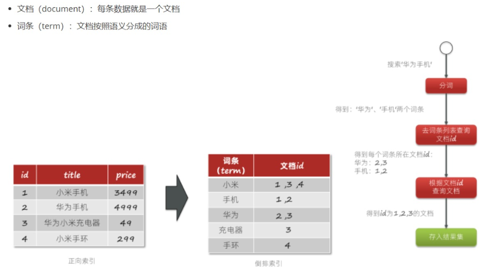
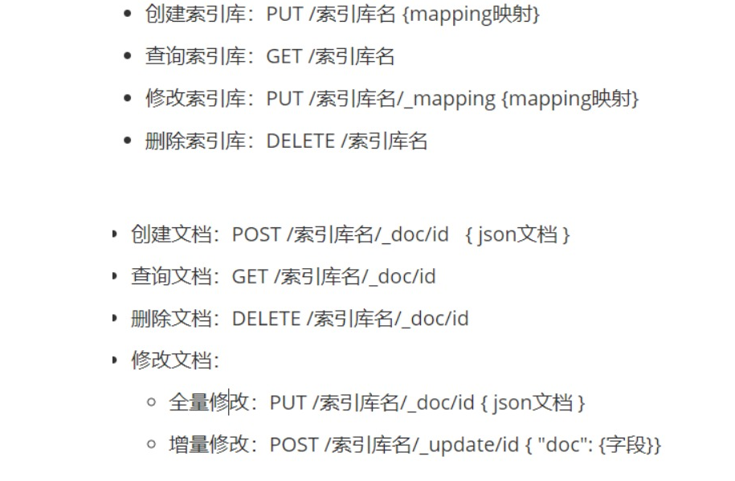
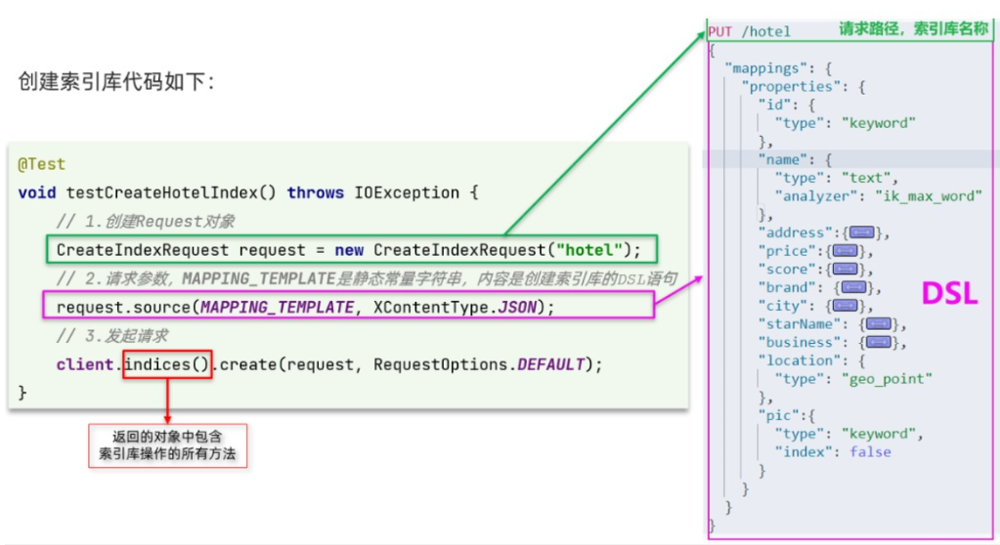
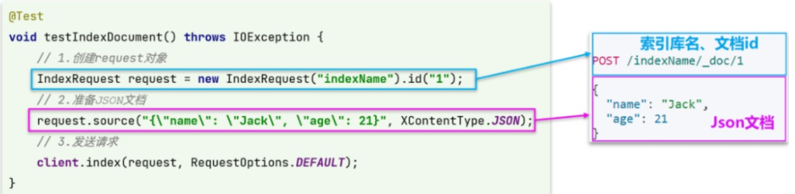
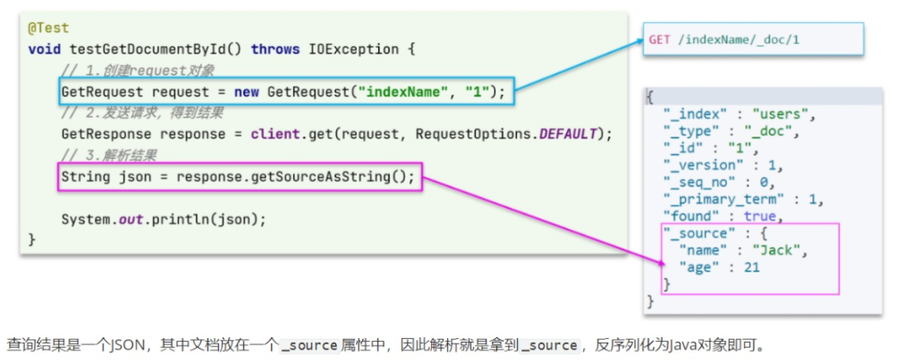
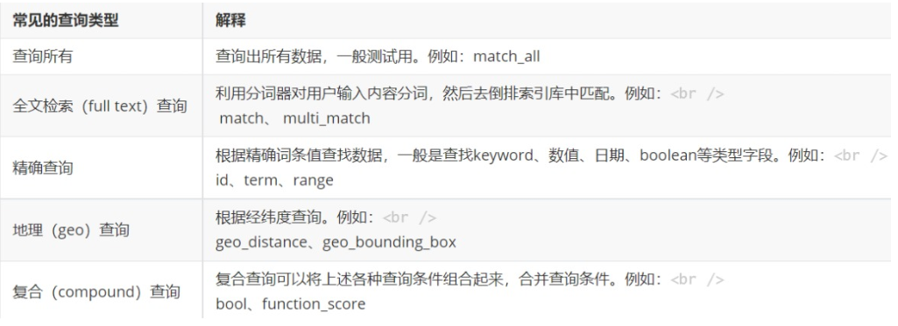
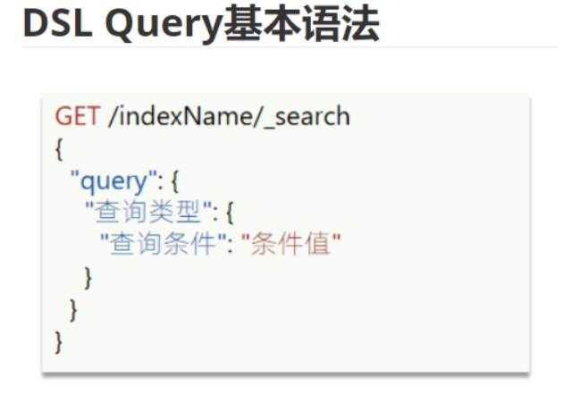
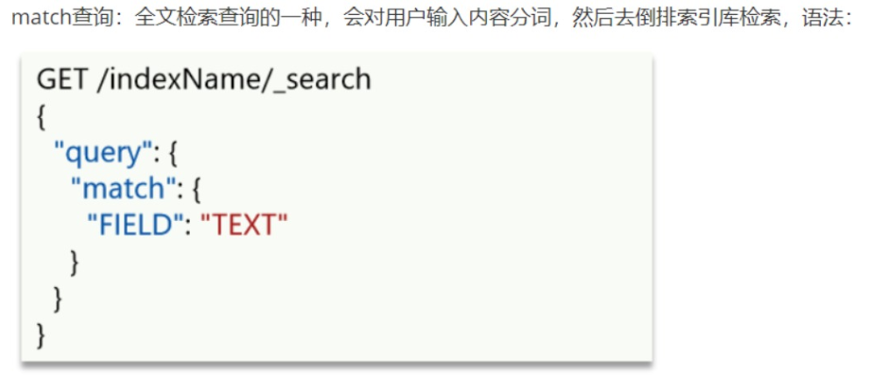
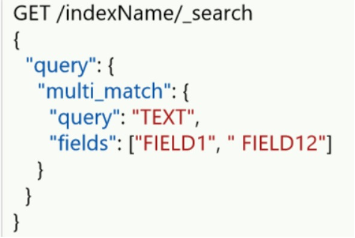
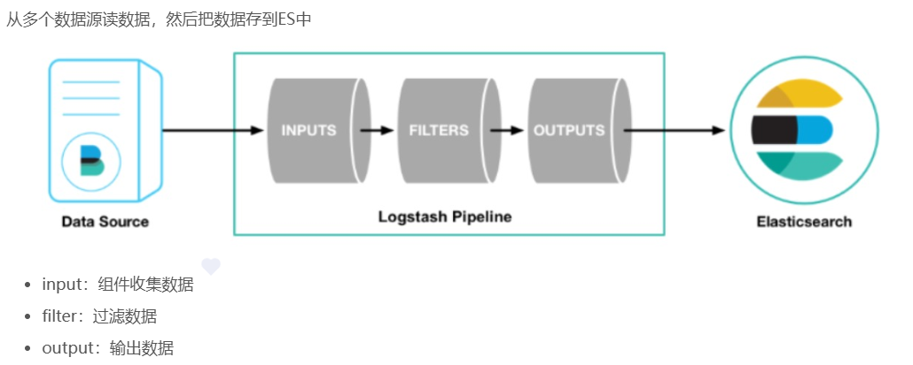

# ES

> Elasticsearch 倒排索引、Logstash

## ES
ES就类似数据库，用于存储海量数据
### 问题：为什么ES能快速查找数据？
ES用来倒排索引来存储文档！

ES刚开始得到数据后会根据搜索的关键字创建出一个词条和文档

查询的时候会根据词条作为索引关键字，倒排索引主要有两个组件构成，词条和文档

词条列表记录了每个文档中包含哪些单词

文档列出了所有在文档集合中出现过的单词所对应的id

正常 MySQL是这样存储的：要是查找的时候会根据索引id一个一个找，假如有100w条数据，我只查询小米手机，如果只有索引1有小米手机的话，MySQL也会把所有的索引找一遍，非常浪费时间
| id  | 名字     | 价格 |
| --- | -------- | ---- |
| 1   | 小米手机 | 3000 |
| 2   | 华为手机 | 4000 |
| 3   | 苹果     | 5000 |

ES会根据数据库以json格式另外存在一个文档里，查找的时候只需要根据词条查找，然后通过各自对应id的并集查到想要的数据
| 词条(term) | 文档（id） |
|------------|------------|
| 小米       | 1          |
| 手机       | 1,2        |
| 华为       | 2          |
| 苹果       | 3          |

### 比喻：
可以比作是去图书馆找一本书，如果你要找一本SpringBoot的书和MySQL的书，去了书店找了半天，最后发现没有，体验肯定很差。

所以我们可以把书都分类，以单词名字开头来找，比如s开头的书都放一起，然后你就可以快速找到有没有这本书！

### 问题：存在哪里？用什么存？
ElasticSearch就相当于MySQL数据库。我们也需要有个图形工具来操作，这个工具叫Kibana

下载好镜像后，我们放在容器中执行，首先要让es和kibana容器互联。这里先创建一个网络：
~~~
docker network create es-net
~~~
运行docker命令：
~~~
docker run -d \
	--name es \
    -e "ES_JAVA_OPTS=-Xms512m -Xmx512m" \
    -e "discovery.type=single-node" \
    -v es-data:/usr/share/elasticsearch/data \
    -v es-plugins:/usr/share/elasticsearch/plugins \
    --privileged \
    --network es-net \
    -p 9200:9200 \
    -p 9300:9300 \
elasticsearch:7.12.1
~~~
之后在浏览器中输入：http://localhost:9200 即可看到elasticsearch的响应结果：
下载好可视化界面Kibana后，加载镜像：
~~~
docker run -d \
--name kibana \
-e ELASTICSEARCH_HOSTS=http://es:9200 \
--network=es-net \  
-p 5601:5601  \
kibana:7.12.1
~~~
Kibana启动比较慢，我们稍等一会，可以查看运行日志：
~~~
docker logs -f kibana
~~~
### 问题：词条可以自己设定都有哪些词吗？
可以安装IK分词器，分词器有两种模式 同时如果我们要新创建词语的话，也可以在IKAnalyzer.cfg.xml配置文件内容中修改添加
- ik_smart：最少切分
- ik_max_word：最细切分
### 什么是索引库？什么是文档？
索引库就相当于mysql里面的一张表，文档就是存储的一行一行的数据，只不过是按照json格式存储的

添加索引库：
~~~
PUT /heima
{
  "mappings": {
    "properties": {
      "info":{
        "type": "text",
        "analyzer": "ik_smart"
      },
      "email":{
        "type": "keyword",
        "index": false
      },
      "name":{
        "properties": {
          "firstName":{
            "type":"keyword"
          },
          "lastName":{
            "type":"keyword"
          }
        }
      }
    }
  }
}
~~~
查看索引库： get /索引库名

修改索引库：
~~~
PUT /索引库名/_mapping
{
  "properties": {
    "新字段名":{
      "type": "integer"
    }
  }
}
~~~
删除索引库：DELETE /索引库名

新增文档：
~~~
POST /索引库名/_doc/文档id
{
    "字段1": "值1",
    "字段2": "值2",
    "字段3": {
        "子属性1": "值3",
        "子属性2": "值4"
    }
}
~~~
查看文档： GET /索引库名称/_doc/文档id

修改文档： 修改文档就是把原来的覆盖掉，重新建一个，如果没有对应的id，就和新增一样了，会新建一个
~~~
PUT /索引库名/_doc/文档id
{
    "字段1": "值1",
    "字段2": "值2"
}
~~~
修改部分字段：
~~~
POST /索引库名/_update/文档id
{
    "doc": {
         "字段名": "新的值"
    }
}
~~~
删除文档： DELETE /索引库名/_doc/id值
### 问题：在java中怎么操作？
导入ES的依赖
~~~
<dependency>
    <groupId>org.elasticsearch.client</groupId>
    <artifactId>elasticsearch-rest-high-level-client</artifactId>
</dependency>
~~~
因为SpringBoot默认的ES版本是7.6.2，所以我们需要覆盖默认的ES版本：
~~~
<properties>
    <java.version>11</java.version>
    <elasticsearch.version>7.12.1</elasticsearch.version>
</properties>
~~~
连接ES：
~~~
// 方式一  自己拼路径
RestHighLevelClient client = new RestHighLevelClient(
    RestClient.builder(HttpHost.create("http://192.168.200.130:9200"))
);

// 方式二   连接ip地址     端口     协议
RestHighLevelClient client = new RestHighLevelClient(
        RestClient.builder(new HttpHost("192.168.200.130", 9200, "http"))
);
~~~
关闭ES：
~~~
client.close();
~~~
### 问题： 每次创建文档都要来连接一次，有简单的方法吗？
我们可以把它抽取出来
~~~
private RestHighLevelClient client;

@BeforeEach //方法执行之前先执行
void initClient() {  // 连接ES
    client = new   RestHighLevelClient(RestClient.builder(HttpHost.create("http://192.168.200.130:9200")));
}

@AfterEach// 方法执行之后执行
void closeClient() throws IOException {
    client.close(); //关闭ES
}
~~~
### 问题：连接好了，接下来怎么创建索引库呢？

~~~
//创建一个请求  括号里的是索引库名称，不用加/ ，会自动识别
CreateIndexRequest request = new CreateIndexRequest("你要创建的索引库的名称");
//准备DSL    括号里的是请求参数，因为已经定义了常量，所以这里直接用  后面是指定什么数据类型
CreateIndexRequest source = request.source(HotelConstants.MAPPING_TEMPLATE, XContentType.JSON);
//发送请求
client.indices().create(request, RequestOptions.DEFAULT);
~~~
### 问题：怎么判断索引库是否存在？
~~~
// 1.创建Request对象发送请求
GetIndexRequest request = new GetIndexRequest("这里输入索引库的名称");
// 2.发送请求，检查指定的索引是否存在
boolean exists = client.indices().exists(request, RequestOptions.DEFAULT);
// 3.输出
System.err.println(exists ? "索引库已经存在！" : "索引库不存在！");
~~~
### 问题：怎么删除索引库？ indices是操作数据库怎么样怎么样
~~~
// 发送请求 
DeleteIndexRequest hotel = new DeleteIndexRequest("hotel");
        AcknowledgedResponse delete = client.indices().delete(hotel,RequestOptions.DEFAULT); //删除
~~~
### 问题：索引库有了，怎么添加文档呢？

~~~
//这里我们新创建一个类
    @Autowired  //查询数据库
    private IHotelService hotelService;

    private RestHighLevelClient client;
    @BeforeEach //方法执行前开启连接ES
    void initClient() {
        this.client = new RestHighLevelClient(RestClient.builder(
                HttpHost.create("http://192.168.136.130:9200")
        ));
    }

    @AfterEach //方法执行完后执行
    void closeClient() throws IOException {
        this.client.close(); //关闭ES
    }

	public void test(){
       //从MySQL数据库获取酒店数据
        Hotel byId = hotelService.getById(36934L);
        //把MySQL转为ES实体（这边是写了一个ES的一个构造方法）
        HotelDoc hotelDoc = new HotelDoc(byId);
        //然后把ES实体转换为JSon（因为ES存的都是json格式）
        String json = JSON.toJSONString(hotelDoc);
        //1 创建request连接，发送请求 （输入ES索引库名称，id是ES的id，因为要求id是字符串类型，所以toString转为字符串）
        IndexRequest hostl = new IndexRequest("hostl").id(hotelDoc.getId().toString());
        //2 准备要存储的数据 DSL  然后指定要存储的数据类型
        hostl.source(json, XContentType.JSON);
        //3 发送请求   后面这个是告诉ES我传的的格式是默认的格式
        client.index(hostl, RequestOptions.DEFAULT);
    }
~~~
### 问题：怎么查看文档？

~~~
//创建请求对象（输入索引库名称和查询的id）
GetRequest hotel = new GetRequest("hotel", "369341");
//发送请求，得到结果  response就是得到的ES的原始结构
GetResponse response = client.get(hotel, RequestOptions.DEFAULT);
//解析结果，通过方法getSourceAsString得到json字符串
String json = response.getSourceAsString();
System.out.println(json); //json格式的文档
//json转成java格式（通过方法SON.parseObject把json转为java对象）
HotelDoc hotelDoc = JSON.parseObject(json, HotelDoc.class);
System.out.println(hotelDoc);//java格式的文档
~~~
因为全部修改就是新增覆盖，所以和新增一样。
~~~
//创建请求对象 ，传入要修改的id
 UpdateRequest request = new UpdateRequest("hotel", "369341");
 //输入要修改的参数
 request.doc("age",100,"name","我的新名字");
 //发送请求，更新文档
 client.update(request, RequestOptions.DEFAULT);
~~~
### 问题：怎么删除文档？
~~~
//创建请求对象，输入要删除的id
DeleteRequest request = new DeleteRequest("hotel", "369341");
//发送请求，删除文档
client.delete(request, RequestOptions.DEFAULT);
~~~
### 问题：上面都是一个一个添加文档，怎么批量处理文档呢？
这里拿批量添加来举例，我们可以用BulkRequest
~~~
//获取mysql所有数据
 List<Hotel> list = hotelService.list();
 //创建批量BulkRequest对象
 BulkRequest request = new BulkRequest();
 //用for循环取出所有的数据
 for (Hotel hotel : list) {
  //把获取到的所有Mysql对象转换为ES实体
  HotelDoc hotelDoc = new HotelDoc(hotel);
  //把ES实体转换为json
  String jsonString = JSON.toJSONString(hotelDoc);
  //把对象都批量存储到BulkRequest对象中
  request.add(new IndexRequest("hostl").id(hotelDoc.getId().toString()).source(jsonString, XContentType.JSON));
       }
  //统一发送请求
  client.bulk(request, RequestOptions.DEFAULT);
~~~
### ES有了数据库了，怎么查询呢？
常见的查询类型分为4类：

第一个是查询所有数据用于测试：

~~~
# 查看全部数据
GET /索引库名/_search
{
  "query": {
    "match_all": {
    }
  }
}
~~~
#### 全文检索查询：
一般用于输入关键字查询，得到词条后会去倒排索引库匹配关键字，查询需要的文档，返回用户。

可以理解为你要去图书馆找一本书，要根据书的名字取对应的书架找需要的书。

**match查询：根据字段名查找**

~~~
# 全文检索
GET /hotel/_search
{
  "query": {
    "match": {
      "字段名": "对应的名称"
    }
  }
}
~~~
**multi_match查询：与match查询类似，只不过允许同时查询多个字段。**

~~~
# 全文检索多个
GET /hotel/_search
{
  "query": {
    "multi_match": {
      "query": "如家",
      "fields": ["地址","城市","品牌"]
    }
  }
}
~~~
**两个查询效果一样，有什么区别呢？**
match查询只是根据字段就能查出所有，而multi_match是根据多个字段查询，虽然比较精确，但查询的也多，对查询性能也大，所以建议使用单字段查询方式
### Logstash

