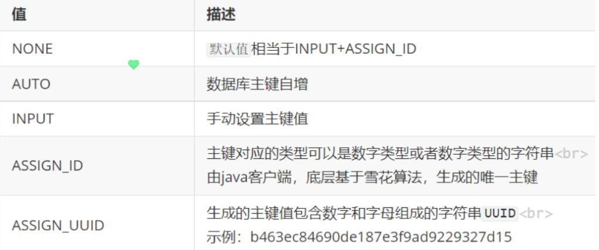
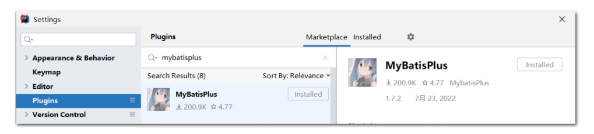

# MybatisPlus

> 自动填充 时间、分页插件、逻辑删除、代码生成器

## 使用
导入依赖
```
<!--mybatis plus依赖-->
<dependency>
    <groupId>com.baomidou</groupId>
    <artifactId>mybatis-plus-boot-starter</artifactId>
    <version>3.4.1</version>
</dependency>
```
连接配置文件：
```
spring:
  datasource:
    # 使用druid连接池
    type: com.alibaba.druid.pool.DruidDataSource
    # 数据源配置
    druid:
      driver-class-name: com.mysql.cj.jdbc.Driver
      url: jdbc:mysql://localhost:3306/mp_demo?useUnicode=true&IntegerEncoding=utf8&useSSL=false&servertimeZone=Asia/Shanghai
      username: root
      password: root

mybatis-plus:
  configuration:
    # 开启驼峰命名规则，默认true开启
    map-underscore-to-camel-case: true
    # 控制台日志打印，便于查看SQL
    log-impl: org.apache.ibatis.logging.stdout.StdOutImpl
```
ORM O是对象实体类 R是数据库表 M是把表和实体类建立映射关系
有了数据库和实体类后，我们创建一个Mapper接口：在接口上继承
>extends BaseMapper<实体类名> 

直接导入使用：
```   
@Autowired
   private ProductMapper productMapper;
// 查询
   @Test
   public void test01()throws Exception{
       // 根据id查询
       Product product = productMapper.selectById(1L);
       System.out.println(product);

       // 查询所有
       List<Product> list = productMapper.selectList(null);
       list.forEach(System.out::println);
   }
   // 新增（支持动态sql）
   @Test
   public void test02()throws Exception{
       // 模拟前端传入对象
       Product product = new Product();
       product.setId(13L);
       product.setPname("iphone14");
       product.setPrice(2999D);
       product.setNum(99);
       product.setBrand("苹果");
       // 调用mapper新增
       productMapper.insert(product);

   }
   // 修改（支持动态sql）
   @Test
   public void test03()throws Exception{
       // 模拟前端传入对象
       Product product = new Product();
       product.setId(13L);
       product.setPrice(1999D);
       // 调用mapper修改
       productMapper.updateById(product);
   }
   // 删除
   @Test
   public void test04()throws Exception{
       productMapper.deleteById(13L);
   }
```
如果类名和数据库名不一致的话，需要添加注解，如果一样的话，就不用写这个注解了
```
@TableName("tbl_product") //绑定表关系 写数据库表的名字
```

### 问题：如果多个表的前缀都一样，我们需要都在实体类上写注解，有什么好的办法吗？  
如果好多个表名前缀一样，都是tb_开头的，我们可以配置配置文件，这样的话，我们类名只用写后面的就可以，MybatisPlus会根据配置的前缀自动识别表名
```
mybatis-plus:
  global-config:
    db-config:
      table-prefix: tbl_ #表前缀
```
### 问题：每次我们都是根据表的主键id寻找数据，如果表的id和实体类的id不一致会怎么样？
会报错，找不到对应的id。假如实体类主键id名字叫id，表的主键id叫pid，那么我们就需要在实体类的主键id上添加@TableId(value=”pid”)注解来识别数据表的主键id
### 问题：如果我们用微服务，会有多个数据库，我们通过主键id添加查询的时候会有冲突，有什么办法解决？
正常我们是用数据库id自增，如果单体项目可以使用，但要是多个项目的话就会冲突，所以我们需要给他设置一个唯一的id
> 

我们可以在注解中指定主键类型
@TableId(value = “id”,type = IdType.AUTO)
type就是设置主键类型，默认就是使用雪花算法，生成一个唯一的id

当然，如果大部分表都要设置的话，我们也可以在配置文件中设置
```
mybatis-plus:
  global-config:
    db-config:
      id-type: auto #主键策略
      table-prefix: tbl_ #表前缀
```
### 问题：上面是主键id不一样，要是还有其他名字不一样，有解决办法吗？
如果实体类跟数据表字段名不一致的话，我们可以添加@TableField(value=”数据表的名称”)，来修改
### 问题：当实体类中有些特殊字段，在数据库表中没有，我们不排除会怎么样？
如果不排除，会映射不到，所以我们可以通过在特殊字段上添加@Tablefield(exist=false)注解来排除，这样的话，增删改查就不会包含该字段了
### 问题：每次创建用户时，都需要设置创建时间，修改，比较麻烦，有什么办法解决？
我们可以设置自动默认填充，这样就不用每次都手动填充。在需要配置的时间上面添加@TableField(fill = FieldFill.INSERT)
设置好之后我们需要指定要填充什么时间，所以这里我们需要一个配置类
```
@Slf4j
@Component
public class MyMetaObjectHandler implements MetaObjectHandler {

    @Override
    public void insertFill(MetaObject metaObject) {
        log.info("start insert fill ....");
        this.strictInsertFill(metaObject, "createTime", Date.class, new Date()); // 起始版本 3.3.0(推荐使用)
        this.strictInsertFill(metaObject, "lastUpdateTime", Date.class, new Date()); // 起始版本 3.3.0(推荐使用)
    }

    @Override
    public void updateFill(MetaObject metaObject) {
        log.info("start update fill ....");
        this.strictUpdateFill(metaObject, "lastUpdateTime", Date.class, new Date()); // 起始版本 3.3.0(推荐)

    }
}
```
## 条件查询
比如：查询 price > xx 并且 pname包含华为的产品信息

用SQL查:
```
select * from tbl_product where price> 500 and pname like '%华为%'
```
用MybatisPlus查:
```
//导入mapper
 @Autowired
 private ProductMapper productMapper;
//先模拟接收前端参数
String pname = “华为”;
Double price = 500;
//创建条件对象
QueryWrapper<实体类名> queryWrapper = new QueryWrapper<>();
//拼条件,前面是数据库的名字，后面是对比的值
queryWrapper.gt("price",price);
//and pname like '%华为%'
queryWrapper.like("pname",pname);
List<接收的实体类名> list = productMapper.selectList(queryWrapper);
list.forEach(System.out::println);
```
如果前端传了空值，我们这边就会查询失败，所以要加个判断
```
//导入mapper
 @Autowired
 private ProductMapper productMapper;
//先模拟接收前端参数
String pname = “华为”;
Double price = 500;
//创建条件对象
QueryWrapper<实体类名> queryWrapper = new QueryWrapper<>();
//拼条件,前面是数据库的名字，后面是对比的值
if(price!=null){
 queryWrapper.gt("price",price);   
}
//and pname like '%华为%'
if(StrUtil.isNotEmpty(pname)){
    queryWrapper.like("pname",pname);
}
List<接收的实体类名> list = productMapper.selectList(queryWrapper);
list.forEach(System.out::println);
```
### 问题：一两个参数判断还行，如果参数多了，有什么校验的好办法吗？
```
//导入mapper
@Autowired
private ProductMapper productMapper;
//先模拟接收前端参数
String pname = “华为”;
Double price = 500;
//创建条件对象
QueryWrapper<实体类名> queryWrapper = new QueryWrapper<>();
//拼条件,前面是校验判断，中间是数据库的值，后面是对比的值
queryWrapper.gt(price!=null, "price",price);
//and pname like '%华为%' 这里同样
queryWrapper.like(StrUtil.isNotEmpty(pname),"pname",pname);
List<接收的实体类名> list = productMapper.selectList(queryWrapper);
list.forEach(System.out::println);
```
### 问题：如果中间我输入数据库的名字输入错了，或者以后修改了数据库的字段，这边就识别不到了，有什么办法解决？
我们之前是用QueryWrapper来创建对象，这边还支持LambdaQueryWrapper
```
@Test
public void test03() throws Exception {
    // 模拟接收前端参数
    String pname = "华为";
    Double price = 500d;

    // 创建条件对象
    LambdaQueryWrapper<Product> lambdaQueryWrapper = new LambdaQueryWrapper<>();
    // price > 500  这里的话我们就可以直接通过解析实体类属性来传入参数
    lambdaQueryWrapper.gt(price!=null,Product::getPrice,price);
    // and pname like '%华为%' 前后都加     likeLeft("%xx")左开头   likeRight("xx%")右结尾
    lambdaQueryWrapper.like(StrUtil.isNotEmpty(pname),Product::getPname,pname);

    List<Product> list = productMapper.selectList(lambdaQueryWrapper);
    list.forEach(System.out::println);
}
```
### 问题：怎么优化提升？
我们可以使用链式编程
```
// 条件查询 select * from tbl_product where price> 500 and pname like '%华为%'
@Test
public void test04() throws Exception {
    // 模拟接收前端参数
    String pname = "华为";
    Double price = 500d;

    // 创建条件对象
    LambdaQueryWrapper<Product> lambdaQueryWrapper = new LambdaQueryWrapper<>();

    // 链式编程
    lambdaQueryWrapper
        .gt(price!=null,Product::getPrice,price) // price > 500
        .like(StrUtil.isNotEmpty(pname),Product::getPname,pname); // and pname like '%华为%' 

    List<Product> list = productMapper.selectList(lambdaQueryWrapper);
    list.forEach(System.out::println);
}
```
链式编程查询案例：
查询商品信息，查询条件库存 num > 25 或者 price > 3000 ，只展示 id、pname、price、num 字段

Mysql语法：
```
// 设置查询字段   select id,pname,price,num from tbl_product where num > 25 or price > 3000
```
用MybatisPlus查:
```
@Test
public void test05() throws Exception {
    // 构建条件对象
    LambdaQueryWrapper<Product> lambdaQueryWrapper = new LambdaQueryWrapper<>();
    // select id,pname,price,num  （只查询四个字段）
    lambdaQueryWrapper.select(Product::getId,Product::getPname,Product::getPrice,Product::getNum);
    // 链式编程
    lambdaQueryWrapper.gt(Product::getNum,25) // num > 25
        .or()
        .gt(Product::getPrice,3000); // or price > 3000
    
    List<Product> list = productMapper.selectList(lambdaQueryWrapper);
    list.forEach(System.out::println);
}
```
### 问题：什么情况下用lambdaQueryWrapper，什么情况下用QueryWrapper？
如果有实体类来接收，就可以用lambdaQueryWrapper，如果没有实体类接收，就需要用到QueryWrapper  
案例：查询价格 > 3000 的商品信息，展示每个品牌以及对应的库存，根据库存降序展示
mysql查询:
```
select brand, sum(num) as num from tbl_product 
	where price > 3000
	group by brand 
	order by num desc
```
MybatisPlus查询：
```
// 分组、聚合、排序
    public void test06()throws Exception{
        // 创建条件对象（这里就不能使用lambda）
        QueryWrapper<Product> queryWrapper = new QueryWrapper<>();

        // 链式编程
        queryWrapper
                .select("brand","sum(num) as num") // select brand, sum(num) as num
                .gt("price",3000d) //  where price > 3000
                .groupBy("brand") //  group by brand
                .orderByDesc("num"); //  order by num desc

        // 执行查询  因为返回结果没有实体类接收，所以这里用map接收
        List<Map<String, Object>> list = productMapper.selectMaps(queryWrapper);
        list.forEach(System.out::println);

    }
```
## 条件修改
需求：将小米10S手机价格设置为3999
```
update tbl_product set price = 3999 where pname = "小米10S"
```
用MybatisPlus修改：
```
public void test07()throws Exception{
    // 条件对象  // where pname = "小米10S"
    UpdateWrapper<Product> updateWrapper = new UpdateWrapper<>();
    updateWrapper.eq("pname","小米10S");

    // 实体对象  set price = 3999
    Product product = new Product();
    product.setPrice(3999d); // 在实体类这里修改
	//把修改的值和条件传进去
    productMapper.update(product,updateWrapper);
}
```
## 条件删除
删除OPPO手机  
用mysql删除：
```
DELETE FROM tbl_product WHERE pname = "OPPO K9";
```
MybatisPlus删除:
```
@Test
public void test08()throws Exception{
    // 条件对象
    QueryWrapper<Product> queryWrapper = new QueryWrapper<>();
    queryWrapper.eq("pname","OPPO K9");
    productMapper.delete(queryWrapper);
}
```
### 问题：之前都是用PageHelper分页，MybatisPlus有分页插件吗？
MybatisPlus内置了专门用于分页的插件
首先添加配置类：
```
// MP配置类
@Configuration
public class MybatisPlusConfig {


     // MyBatisPlust拦截器配置
    @Bean
    public MybatisPlusInterceptor mybatisPlusInterceptor() {
        MybatisPlusInterceptor interceptor = new MybatisPlusInterceptor();
        // 添加分页插件拦截器
        interceptor.addInnerInterceptor(new PaginationInnerInterceptor(DbType.MYSQL));
        return interceptor;
    }

}
```
普通分页查询：
```
@Autowired
 private ProductService productService;

 // 分页查询  select * from tbl_product  limit 0 ,5
 @Test
 public void test01() throws Exception {
     // 前端提供：当前页、每页个数
     Page<Product> page = new Page<>(1, 5);

     // 执行分页查询（page是引用数据类型对象，不指定返回值结果还是封装到了page中）
     productService.page(page);

     // 取出结果
     System.out.println(page.getTotal()); // 总记录数
     System.out.println(page.getRecords()); // 当前页集合

 }
```
条件分页查询：
```
// 条件分页查询  select * from tbl_product where price > 1500 limit 0 ,5
@Test
public void test02() throws Exception {
    // 前端提供：当前页、每页个数
    Page<Product> page = new Page<>(1, 5);


    // 条件对象
    LambdaQueryWrapper<Product> queryWrapper = new LambdaQueryWrapper<>();
    queryWrapper.gt(Product::getPrice,1500d);

    // 执行分页查询（page是引用数据类型对象，不指定返回值结果还是封装到了page中）
    productService.page(page,queryWrapper);

    // 取出结果
    System.out.println(page.getTotal()); // 总记录数
    System.out.println(page.getRecords()); // 当前页集合

}
```
### 问题：数据删除后就没有了，如果年底要统计数据，怎么办？
我们可以逻辑删除，就是把数据设置一个状态，状态为1就存在，状态为0就是删除了，  

先在数据表中添加属性deleted，然后在实体类中设置deleted，然后在这个属性上面标记为逻辑删除字段，通过 @TableLogic 注解标识这是逻辑删除字段，
```
@TableLogic
private Integer deleted;
```
全局配置逻辑删除
@TableLogic 只是单个表设置逻辑删除字段，如果多张表都需要配置逻辑删除，则可以做全局配置

这样只要有deleted属性都被认为是做逻辑删除
```
mybatis-plus:
  global-config:
    db-config:
      logic-delete-field: deleted # 全局逻辑删除的实体字段名
      logic-delete-value: 1 # 逻辑已删除值(默认为 1)
      logic-not-delete-value: 0 # 逻辑未删除值(默认为 0)
```
## Service接口
为了简化service代码编写，mybatisPlus提供了通用 Service CRUD 封装IService接口
进一步封装 CRUD 采用 get 查询单行 remove 删除 list 查询集合 page 分页 前缀命名方式区分 Mapper 层避免混淆

| 分类 | 方法 | 描述 |
| :--- | :--- | :--- |
| 新增 | `boolean save(T entity)` | 新增，entity 实体对象 |
|  | `boolean saveOrUpdate(T entity)` | id存在则更新记录，否则插入一条记录 |
|  | `boolean saveBatch(Collection<T> entityList)` | 插入（批量），默认一次可以保存1000条数据 |
| 修改 | `boolean updateById(T entity)` | 根据 ID 修改 |
|  | `boolean update(T entity, Wrapper updateWrapper)` | 根据条件修改 |
| 查询 | `T getById(Serializable id)` | 根据 ID 查询 |
|  | `List<T> listByIds(Collection<? extends Serializable> idList)` | 查询（根据ID 批量查询） |
|  | `List<T> list()` | 查询所有 |
|  | `List<T> list(Wrapper<T> queryWrapper)` | 条件查询 |
| 删除 | `boolean removeById(Serializable id)` | 根据 ID 删除 |
|  | `boolean removeByIds(Collection<? extends Serializable> idList)` | 删除（根据ID 批量删除） |
|  | `boolean remove(Wrapper<T> queryWrapper)` | 根据条件删除 |

### 改造Service
使用Service 接口使用
- 接口继承 IService
- 实现类继承 ServiceImpl<M,T>

Service 接口
继承 IService 接口，泛型 T 是实体类类型，M是DAO接口
### 问题：每次创建用户，都要设置创建时间，修改时间，怎么才能不用每次设置？
| 值 | 描述  |
| :--- |:----|
|DEFAULT	|默认不处理|
|INSERT	|插入时填充字段|
|UPDATE	|更新时填充字段|
|INSERT_UPDATE	|插入和更新时填充字段|

在实体类中字段上面设置
```
@TableField(fill = FieldFill.INSERT)
private Date createTime;

@TableField(fill = FieldFill.INSERT_UPDATE)
private Date lastUpdateTime;****
```
配置类设置填充值
```
@Slf4j
@Component
public class MyMetaObjectHandler implements MetaObjectHandler {

    @Override
    public void insertFill(MetaObject metaObject) {
        log.info("start insert fill ....");
        this.strictInsertFill(metaObject, "createTime", Date.class, new Date()); // 起始版本 3.3.0(推荐使用)
        this.strictInsertFill(metaObject, "lastUpdateTime", Date.class, new Date()); // 起始版本 3.3.0(推荐使用)
    }

    @Override
    public void updateFill(MetaObject metaObject) {
        log.info("start update fill ....");
        this.strictUpdateFill(metaObject, "lastUpdateTime", Date.class, new Date()); // 起始版本 3.3.0(推荐)

    }
}
```
## 分页插件
添加分页插件拦截器
```
// MP配置类
@Configuration
public class MybatisPlusConfig {

     // MyBatisPlust拦截器配置
    @Bean
    public MybatisPlusInterceptor mybatisPlusInterceptor() {
        MybatisPlusInterceptor interceptor = new MybatisPlusInterceptor();
        // 添加分页插件拦截器
        interceptor.addInnerInterceptor(new PaginationInnerInterceptor(DbType.MYSQL));
        return interceptor;
    }
}
```
测试
```
@SpringBootTest
public class PageTest {

    @Autowired
    private ProductService productService;

    // 分页查询  select * from tbl_product  limit 0 ,5
    @Test
    public void test01() throws Exception {
        // 前端提供：当前页、每页个数
        Page<Product> page = new Page<>(1, 5);
        // 执行分页查询（page是引用数据类型对象，不指定返回值结果还是封装到了page中）
        productService.page(page);
        // 取出结果
        System.out.println(page.getTotal()); // 总记录数
        System.out.println(page.getRecords()); // 当前页集合
    }

    // 条件分页查询  select * from tbl_product where price > 1500 limit 0 ,5
    @Test
    public void test02() throws Exception {
        // 前端提供：当前页、每页个数
        Page<Product> page = new Page<>(1, 5);
        // 条件对象
        LambdaQueryWrapper<Product> queryWrapper = new LambdaQueryWrapper<>();
        queryWrapper.gt(Product::getPrice,1500d);
        // 执行分页查询（page是引用数据类型对象，不指定返回值结果还是封装到了page中）
        productService.page(page,queryWrapper);
        // 取出结果
        System.out.println(page.getTotal()); // 总记录数
        System.out.println(page.getRecords()); // 当前页集合
    }
}

```
## 代码生成器
安装插件
> 

配置数据源

