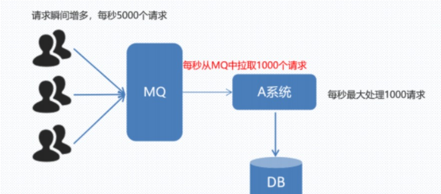

# MQ

> 每个微服务之间通信方式有两种，同步和异步，Feign就是基于http协议的同步通信方式，而MQ是微服务异步调用的方式。

## 先来个小案例：
假设我们做了个12306系统，我们买票成功后，需要做以下几件事：调用库存系统扣减车票库存，调用短信系统给用户发送短信，调用邮件系统给用户发邮件，调用第三方客户端通知买票成功。那么如果这几个服务一直能正常服务，产品经理不在有新的需求变更，那也可称得上现世安稳，岁月静好。可是万一有一天出现这么两种情况可怎么办呢？

1：产品经理提需求，好多人关注了我们12306微信客户端，我们需要买票成功后在通知微信小程序。那么我们又需要修改订单系统的代码。一次还好，如果隔一段时间发生一件这样的事，那谁能忍受？

2： 某一天，短信系统挂了，然后客户成功买到一张票，然后呢是短信也没收到，邮件也没收到，库存也没扣，这还得了。你短信系统坏了，我邮件系统好好的，凭什么影响我，让客户收不到邮件，这就不合理。所以呢，还是各个系统之间的耦合太高了，我们应该解耦。这个时候我们就需要一个中间人来帮我们解决这个问题，那么我们看MQ如何帮我们解决这件棘手的事情。

之前用Feign是这样的：同步调用

用了MQ后可以这样：异步调用

MQ（消息队列 ）是在消息的传输过程中保存消息的容器，就如上案例一样，我们可以来做一个中间的容器，你执行成功失败不会影响别的微服务系统运行

如上图所示，如果用户买了票，我这边可以告诉中间件Broker，然后MQ告诉其他需要执行的业务，其他业务只需要订阅Broker就可以收到消息。如果后面还有其他服务，只需要订阅Broker就可以了，不会影响其他代码的运行，删除也一样。 同时也提高了响应速度。
### 注：
同步调用实效性强，可以直接得到结果，如果直接查询，需要实时性高，Feign比较好，比如我查询订单，你后台半天没返回数据，就会影响客户体验。但如果涉及相应的处理，并且复杂度比较高，或者后期变动情况比较大，还是推荐使用MQ异步，减少后期维护的麻烦，减轻重复工作的可能
## 问题：如果多人访问，发送的请求多了怎么办？
Broker中间是队列，可以帮你拦截，谁先买的票，先帮谁处理

## 问题：MQ的缺点是什么？

最致命的却带你是假如中间MQ出现了宕机，其他系统也不能执行了。

而最常用的消息队列是RabbitMQ，RabbitMQ是基于AMQP的一款消息中间件管理系统

• [官网地址](https://www.rabbitmq.com/)

首先在linux安装

下载镜像：
~~~
docker pull rabbitmq:3.8-management
~~~
安装MQ：
~~~
docker run \
 -v mq-plugins:/plugins \
 --name=mq \
 -p 15672:15672 \
 -p 5672:5672 \
 -d \
 rabbitmq:3.8-management
~~~
账号密码初始都是：guest 开发中咱们不会接触管理员用户，所以这里创建自己的用户

因为要用多个微服务，对应的也有数据库，为了更好区分，我们要隔离起来创建各自项目的虚拟主机

之后管理员给这个用户的虚拟主机分配权限

RabbitMQ消息队列主要分为两种，一种就类似于Feign，点对点模型。另一种是就是分布式的，发布/订阅模型

发布者发布消息后，我们通过交换机接收消息，然后传给队列，队列存储消息，然后再发给各个消费者，生产者能发多个消息，也可以有多个交换机接收，同样，交换机也可以发送多个消息给队列，队列也可以给多个消费者发送消息。
## 问题：在MQ中怎么和Feign一样发送接收消息呢？

1：首先我们先在生产方建立连接工厂，创建连接对象和通道
~~~
public void testSendMessage() throws IOException, TimeoutException {
    // 1.建立连接
    ConnectionFactory factory = new ConnectionFactory();
    // 1.1.设置连接参数，分别是：主机名、端口号、vhost、用户名、密码
    factory.setHost("192.168.200.130");
    factory.setPort(5672);
    factory.setVirtualHost("/quick");
    factory.setUsername("itheima");
    factory.setPassword("123456");
    // 1.2.建立连接
    Connection connection = factory.newConnection();
    // 2.创建通道Channel
    Channel channel = connection.createChannel();
    // 3.创建队列
    String queueName = "simple.queue";
    channel.queueDeclare(queueName, false, false, false, null);
    // 4.发送消息
    String message = "hello, rabbitmq!";
    channel.basicPublish("", queueName, null, message.getBytes());
    System.out.println("发送消息成功：【" + message + "】");
    // 5.关闭通道和连接
    channel.close();
    connection.close();
}
~~~
2 ：在消费者接收
~~~
public static void main(String[] args) throws IOException, TimeoutException {
       // 1.建立连接
       ConnectionFactory factory = new ConnectionFactory();
       // 1.1.设置连接参数，分别是：主机名、端口号、vhost、用户名、密码
       factory.setHost("192.168.200.130");
       factory.setPort(5672);
       factory.setVirtualHost("/quick");
       factory.setUsername("itheima");
       factory.setPassword("123456");
       // 1.2.建立连接
       Connection connection = factory.newConnection();
       // 2.创建通道Channel
       Channel channel = connection.createChannel();
       // 3.创建队列
       String queueName = "simple.queue";
       channel.queueDeclare(queueName, false, false, false, null);
       // 4.订阅消息
       channel.basicConsume(queueName, true, new DefaultConsumer(channel){
           @Override
           public void handleDelivery(String consumerTag, Envelope envelope,
                                      AMQP.BasicProperties properties, byte[] body) throws IOException {
               // 5.处理消息
               String message = new String(body);
               System.out.println("接收到消息：【" + message + "】");
           }
       });
       System.out.println("消费者等待接收消息。。。。");
   }
~~~
## 问题：代码繁琐，有简化的吗？
Spring基于AMQP协议定义的一套API规范，提供了模板来发送和接收消息

1： 引入依赖
~~~
<!--AMQP依赖，包含RabbitMQ-->
        <dependency>
            <groupId>org.springframework.boot</groupId>
            <artifactId>spring-boot-starter-amqp</artifactId>
        </dependency>
~~~
2：生产者：

添加配置文件
~~~
spring:
  rabbitmq:
    host: 192.168.200.130 # 主机名
    port: 5672 # 端口
    virtual-host: /quick # 虚拟主机
    username: itheima # 用户名
    password: 123456 # 密码
~~~
代码：
~~~
注入方法：
  @Autowired
  private RabbitTemplate rabbitTemplate;

 public void test1(){
        //队列名称
        String queueName ="simple.queue";
        //消息内容
        String msg = "Hello World";
        //发送消息，这里的方法是把消息转换为字节，需要接收两个参数，向哪个队列发？ 发什么？
        rabbitTemplate.convertAndSend(queueName,msg);
    }
~~~
消费者：

添加配置文件
~~~
spring:
  rabbitmq:
    host: 192.168.200.130 # 主机名
    port: 5672 # 端口
    virtual-host: /quick # 虚拟主机
    username: itheima # 用户名
    password: 123456 # 密码
~~~
代码
~~~
//监听简单的消息
@RabbitListener(queues = "simple.queue") //监听队列                           @RabbitListener(queuesToDeclare = @Queue("simple.queue")) // 如果mq中没有队列，就会创建
public void listenSimpleQueue(String msg) {
    System.out.println("接收消息："+msg);
}
~~~
## 问题：如果生产者生产了10条消息，消费者不能一下子接收那么多消息，会怎么样？怎么处理?
会出现消息堆积，我们可以开启工作者模式，也就是说弄两个消费者a和b，同时接收消息，a接收1，3，5 。b接收2，4，6。这样的话就可以均匀接收消息了，哪怕有个消费者挂了，也还有消费者接收消息

消费者：
~~~
// 监听工作消息
// 消费者a
@RabbitListener(queuesToDeclare = @Queue("work.queue")) //MQ中没有队列，所以我们这里创建一个
public void listenWorkQueue1(String msg)throws Exception{
    System.out.println("消费者1接收："+msg);
    Thread.sleep(20); //延迟时间
}
//消费者b
@RabbitListener(queuesToDeclare = @Queue("work.queue"))
public void listenWorkQueue2(String msg)throws Exception{
    System.err.println("消费者2接收："+msg);
    Thread.sleep(200);//延迟时间
}
~~~
但是这里虽然分配给了两个消费者，但是没有考虑到消费者的处理能力和性能的差异化，所以这里我们设置prefetch来控制消费者预取的数量，在消费者的配置文件中添加
~~~
spring:
  rabbitmq:
    listener:
      simple:
        prefetch: 1 # 消费者一次处理一条消息，处理完毕后再从MQ中获取
~~~

