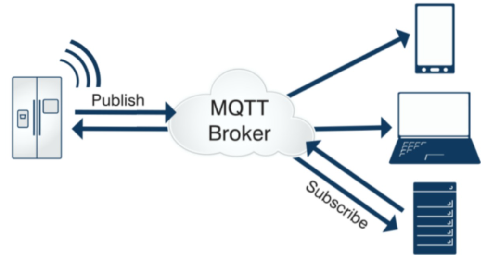
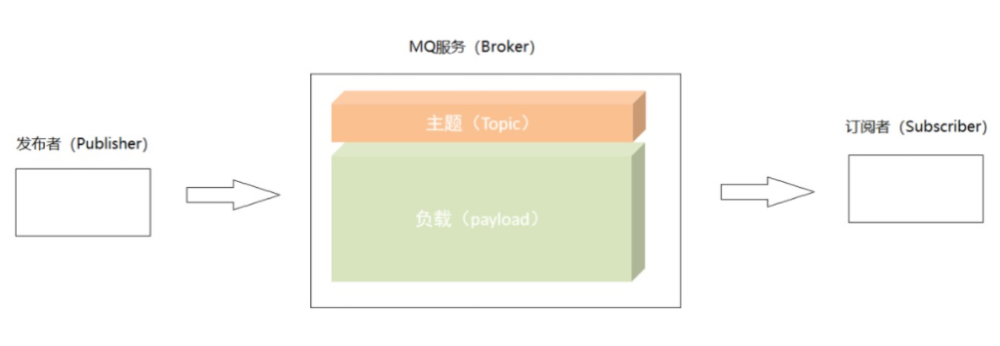
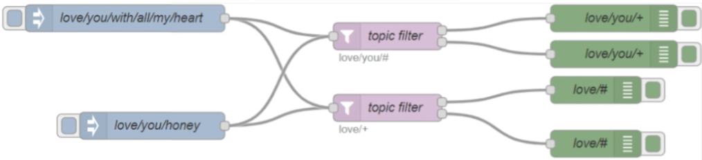
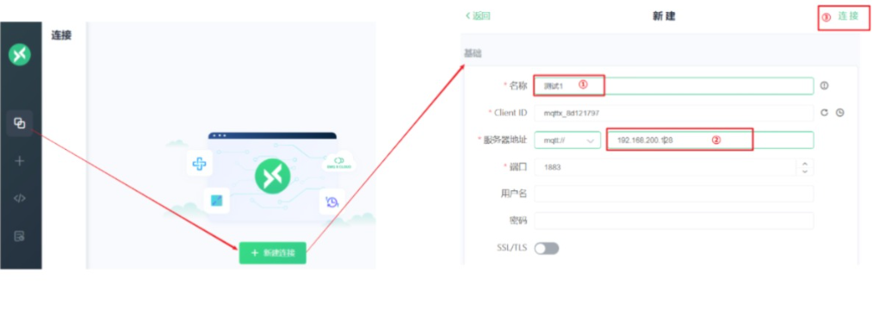
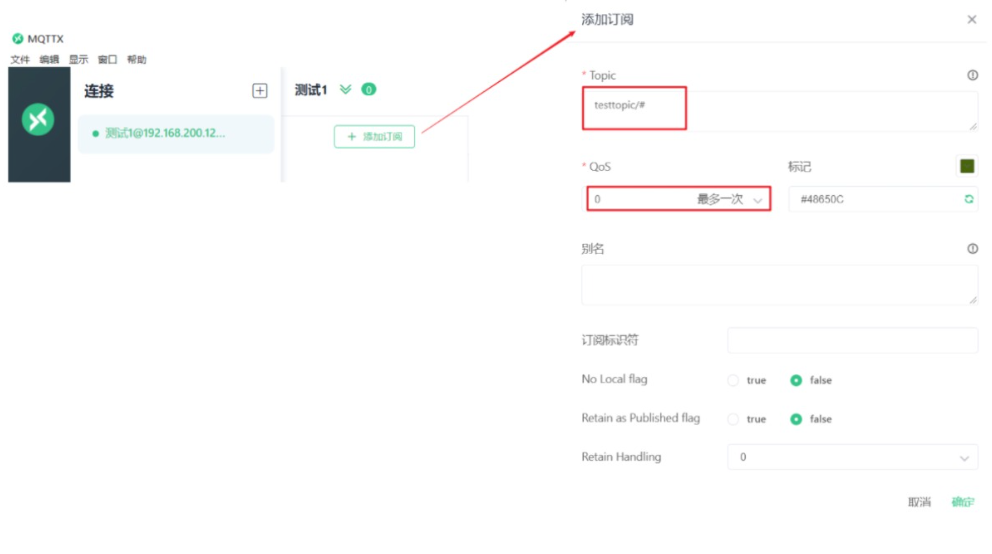
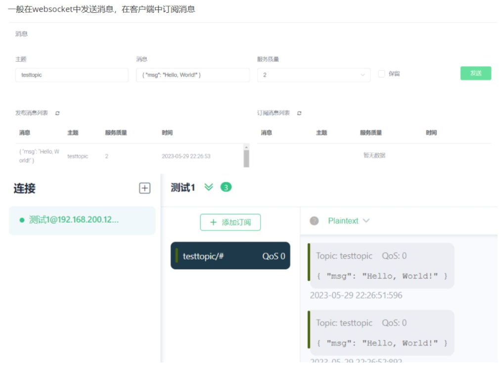
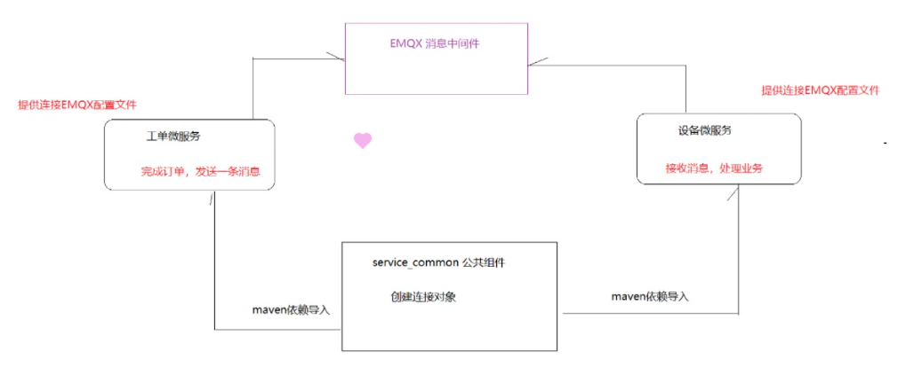

# MQTT

> MQTT、EMQX、MQTTX

## 了解
1：发布者发布一个主题，比如开启车联网的汽车空调，然后会有负载，我们把内容存到负载里面。之后订阅者订阅主题就可以取到内容

2：需要有服务质量，比如连接设备断网了，消息怎么办？

三个级别
Qos0：消息最多传递一次，说白了就是只发一次，发完我就关闭了，有没有收到我不管，如果当时客户端不可用，则丢失这条消息。
Qos1：消息传递至少一次，必须要你收到消息，你断网了没收到，我还会给你发， 直到你收到消息。注意：如果接收端没挂，只是消息堵塞了，那么还会发消息，这个时候接收端就会收到两条消息
Qos2：消息仅传送一次，我发送消息后，等待你给我返回确认，你什么时候确认收到了，我什么时候才会关闭发送消息
如果发布消息/主题订阅/接收消息三方设置的Qos等级不一样， 那么会优先考虑性能（等级最小的优先）

发送消息的时候要订阅主题，那么主题名字需要有命名规则：
比如你要发送汽车相关的，比如 汽车/座椅加热 汽车/开空调…… 那么接收的时候可以用通配符，汽车/* 代表接收有前面汽车的所有消息，可以多层匹配
可以理解为你发快递，发送北京/朝阳区 发到订阅者，然后接收者只要有北京/* 就可以接收到北京/的信息
还有+，这里没写，具体看下面。

延时消息：
用于下单后不支付， 我们可以设置为15分钟后去查看消息，如果为未支付，就关闭订单，恢复库存
发布者发送消息后，接收者15分钟后才能收到消息
怎么用？
在主题前面添加$delayed/DelayInterval/TopicName 最前面的是表示延迟消息，中间的是延迟时间，后面的是主题内容

共享消息：
只要订阅了主题，发送者发送消息后，订阅主题的都能收到消息
比如说有5w台机器，都要发送消息，那么接收端一下子就要接收很多消息，影响性能。这个时候我们可以设置集群，设置多个接收方来接收，接收方1号接收1w条消息，2号接收1w条消息…… ，这样就能提高执行效率了
共享消息是我发送消息后，接收方1号接收消息了，那么2号就不接收了

共享消息分为两种：带群组的 不带群组的

不带群组的：我发送消息1，2，3 接收方1处理1 接受方2处理2 …… 这里分发给谁，可以设置负载均衡，默认的策略是随机

带群组的：比如我订阅消息的有多个，有扣库存的，有通知物流的，我们把这两个分两个组，然后订阅消息。发送方发送消息后，两个组都能收到一条消息

JAVA使用，具体看下面
## 什么是MQTT？
MQ是异步发送消息 MQTT是物联网发送消息，说白了就是冰箱可以给手机发消息，可以给电脑发消息，设备之间互相发送消息，可以理解为订阅MQTT后，就可以给订阅过的设备发送消息了

## 连接设备（客户端）
（1）发布信息；

（2）订阅消息；

（3）退订或删除消息；

（4）断开与服务器连接；
## 中间件（服务端）
（1）接受来自客户端的网络连接；

（2）接受客户端发布的信息；

（3）处理来自客户端的订阅和退订请求；

（4）向订阅的客户转发应用程序消息；
## MQTT协议构成

## MQTT协议方法
MQTT协议中定义了一些方法（也被称为动作），来于表示对确定资源所进行操作：

**（1）CONNECT：客户端连接到服务器**

（2）CONNACK：连接确认

**（3）PUBLISH：发布消息**

（4）PUBACK：发布确认

（5）PUBREC：发布的消息已接收

（6）PUBREL：发布的消息已释放

（7）PUBCOMP：发布完成

**（8）SUBSCRIBE：订阅请求**

（9）SUBACK：订阅确认

（10）UNSUBSCRIBE：取消订阅

（11）UNSUBACK：取消订阅确认

（12）PINGREQ：客户端发送心跳

（13）PINGRESP：服务端心跳响应

**（14）DISCONNECT：断开连接**

（15）AUTH：认证
## 消息服务质量QoS
### MQTT 设计了 3 个 QoS 等级：
- QoS 0：消息最多传递一次，如果当时客户端不可用，则会丢失该消息。

- QoS 1：消息传递至少 1 次。

- QoS 2：消息仅传送一次。
#### QoS 0 等级
QoS0：”至多一次”，消息发布完全依赖底层TCP/IP网络。

**特点**：会发生消息丢失或重复。丢失一次读记录无所谓。

**场景**：可以接受消息偶尔丢失的场景下可以选择 QoS 0。

**举例**：APP消息推送，倘若你的智能设备在消息推送时未联网，推送过去没收到，再次联网也就收不到了。
- 如推送新闻、广告消息
#### QoS 1 等级
QoS1：”至少一次”，确保消息到达，但消息重复可能会发生。
**特点**：消息确保至少成功发送和送达，会有消息重试的情况。

**场景**：物联网大部分场景都是选用 QoS1，它实现了系统资源性能和消息实时性、可靠性最优化

**举例**：普通消息推送，倘若你的智能设备在消息推送时未联网，推送过去没收到，联网后还会收到消息。

- 如软件设备升级消息、车辆行驶记录消息。
#### QoS 2 等级
**特点**：消息确保至少成功发送和送达，不会有消息重复的情况。

**场景**：对于不能忍受消息丢失，且不希望收到重复消息，数据完整性与及时性要求较高的场景，可以选择 QoS 2

**举例**：APP即时消息推送，确保用户收到且只会收到一次。

- QoS2等级可以增加消息可靠性，但同时也使资源消耗和消息时延大幅增加。

- 主要运用于对数据完整性与及时性要求较高的银行、消防、航空等行业。
## 发布与订阅QoS
对于 QoS 等级，在生产方、MQ服务、消费方都可以分别进行设置

但对于生产方和MQ服务设置等级不一致时，消费方会遵循的原则：以最小的等级为标准（性能优先）
## Topic通配符匹配规则

#### 通配符说明
##### 层级分隔符：/
- / 用来分割主题树的每一层，并给主题空间提供分等级的结构。
##### 多层通配符：#
- 多层通配符有可以表示大于等于0的层次。
~~~
love/you/#  
    
适配下面路径：
    love/you
    love/you/with
    love/you/with/all
    love/you/with/all/my/heart
    love/you/with/all/my/hearts
    
love/#/you 				不支持此规则（#只能写在最右侧）
~~~
#### 单层通配符：+
- 只匹配主题的一层。
~~~
love/you/+      

适配下面路径：
	love/you/with
	love/you/and
	
不适配下面路径
	love/you
	love/you/with/all
	
love/+/you                 支持此规则（可以在中间）

适配下面路径：
	love/hehe/you
	love/all/you
~~~
#### MQTT思想有了，落地实现是什么？
• [EMQX](https://www.emqx.com/zh)  
EMQX Broker 是基于高并发的 Erlang/OTP 语言平台开发，支持百万级连接和分布式集群架构，发布订阅模式的开源 MQTT 消息服务器。
为什么选择EMQ X
- 从支持 MQTT5.0、稳定性、扩展性、集群能力等方面考虑，EMQX 的表现应该是最好的。
- 中国本地的技术支持服务
- 扩展模块和插件，EMQ X 提供了灵活的扩展机制，支持企业的一些定制场景
### 环境搭建：docker安装
~~~
#1：首先拉取emqx的镜像
docker pull emqx/emqx:v4.1.0

#2：使用docker命令运行得到docker容器
docker run -tid --name emqx -p 1883:1883 -p 8083:8083 -p 8081:8081 -p 8883:8883 -p 8084:8084 -p 18083:18083 emqx/emqx:v4.1.0
~~~
#### 访问控制台：
~~~
地址：http://端口号:18083

账号：admin 密码：public
~~~
#### websocket
我们可以在工具中选择websocket来进行消息发送和订阅测试
#### 客户端调试工具
• [MQTTX](https://mqttx.app/)  
创建连接:

填写连接信息

①：填写连接服务名称，可以自己定义。

②：填写连接EMQ服务的地址，这里写下发虚拟机中的ip

③: 其他选项保持默认，点击连接服务即可
#### 订阅主题

#### 发送和订阅

### Java使用
发送方要连接EMQ，接收方也要连接EMQ ，他们连接的话都要有连接协议，连接地址，用户名密码等，连接是一样的，只是发消息和接受消息不一样，
所以连接是重复的，我们可以把连接放在一个公共模块中，Maven依赖导入后，两个微服务就都可以使用了。而两个微服务只需要提供配置文件连接EMQX就可以

1：导入坐标依赖
~~~
<dependency>
  <groupId>org.eclipse.paho</groupId>
  <artifactId>org.eclipse.paho.client.mqttv3</artifactId>
  <version>1.2.5</version>
</dependency>
~~~
2：把公共代码写到公共模块中
#### 创建客户端连接对象：
最上面读的一堆参数就是微服务配置文件中配置的消息
~~~
@Configuration
@Component
@Data
@Slf4j
public class MqttConfig {
    
    @Value("${mqtt.client.username}")
    private String username;
    @Value("${mqtt.client.password}")
    private String password;
    @Value("${mqtt.client.serverURI}")
    private String serverURI;
    @Value("${mqtt.client.clientId}")
    private String clientId;
    @Value("${mqtt.client.keepAliveInterval}")
    private int keepAliveInterval;
    @Value("${mqtt.client.connectionTimeout}")
    private int connectionTimeout;

    @Autowired
    private MqttCallback mqttCallback;

	/*创建MQTT客户端*/
    @Bean
    public MqttClient mqttClient() {
        try {
             //新建客户端 参数：MQTT服务的地址，客户端名称，持久化
            MqttClient client = new MqttClient(serverURI, clientId, mqttClientPersistence());
            //设置手动消息接收确认
            client.setManualAcks(true);
            // 设置回调类（主要用于订阅者客户端接收消息时使用）
            client.setCallback(mqttCallback);
            mqttCallback.setMqttClient(client);
            // 设置连接的配置
            client.connect(mqttConnectOptions());
            return client;
        } catch (MqttException e) {
            log.error("emq connect error",e);
            return null;
        }
    }

    /*创建MQTT配置类*/
    @Bean
    public MqttConnectOptions mqttConnectOptions() {
        MqttConnectOptions options = new MqttConnectOptions();
        options.setUserName(username);
        options.setPassword(password.toCharArray());
        options.setAutomaticReconnect(true);//是否自动重新连接
        options.setCleanSession(true);//是否清除之前的连接信息
        options.setConnectionTimeout(connectionTimeout);//连接超时时间
        options.setKeepAliveInterval(keepAliveInterval);//心跳
        options.setMqttVersion(MqttConnectOptions.MQTT_VERSION_3_1_1);//设置mqtt版本
        return options;
    }

    /*设置持久化*/
    public MqttClientPersistence mqttClientPersistence() {
        return new MemoryPersistence();
    }

}
~~~
#### 发消息：
最上面读的一堆参数就是微服务配置文件中配置的消息
~~~
@Component
@Slf4j
public class MqttProducer {

    @Value("${mqtt.producer.defaultQos}")
    private int defaultProducerQos;
    @Value("${mqtt.producer.defaultRetained}")
    private boolean defaultRetained;
    @Value("${mqtt.producer.defaultTopic}")
    private String defaultTopic;

    @Autowired
    private MqttClient mqttClient;

    /**
     * 只发送消息的方法
     *
     * @param payload 消息信息
     */
    public void send(String payload) {
        this.send(defaultTopic, payload);
    }

    /**
     * 指定topic发送消息的方法
     *
     * @param topic   主体名称
     * @param payload 消息信息
     */
    public void send(String topic, String payload) {
        this.send(topic, defaultProducerQos, payload);
    }

    /**
     * 指定topic和服务质量QoS发送消息的方法
     *
     * @param topic   主体名称
     * @param qos     服务质量（0、1、2）
     * @param payload 消息信息
     */
    public void send(String topic, int qos, String payload) {
        this.send(topic, qos, defaultRetained, payload);
    }

    /**
     * 发送消息的全参方法
     *
     * @param topic    主体名称
     * @param qos      服务质量（0、1、2）
     * @param retained 是否保留消息
     * @param payload  消息信息
     */
    public void send(String topic, int qos, boolean retained, String payload) {
        try {
            mqttClient.publish(topic, payload.getBytes(), qos, retained);
        } catch (MqttException e) {
            log.error("publish msg error.", e);
        }
    }

    /**
     * 指定topic和服务质量QoS发送消息的方法
     *
     * @param topic 主体名称
     * @param qos   服务质量（0、1、2）
     * @param msg   转换为json类对象数据
     */
    public <T extends Object> void send(String topic, int qos, T msg) throws JsonProcessingException {
        String payload = JsonUtil.serialize(msg);
        this.send(topic, qos, payload);
    }
}
~~~
#### 测试发消息
~~~
@Autowired
    private MqttProducer mqttProducer;

    @Test
    public void test() throws Exception {
        mqttProducer.send("主题名字/默认是testtopic","Json格式的消息");
    }
~~~
#### 接收消息
~~~
@Component
@Slf4j
public class MqttCallback implements MqttCallbackExtended {

    //需要订阅的topic配置
    @Value("${mqtt.consumer.consumerTopics}")
    private List<String> consumerTopics;

    @Autowired
    private MqttService mqttService;

    //当与服务器的连接丢失时调用此方法。
    @Override
    public void connectionLost(Throwable throwable) {
        log.error("emq error.",throwable);
    }

    //当消息从服务器到达时调用此方法
    @Override
    public void messageArrived(String topic, MqttMessage message) throws Exception {
        log.info( "topic:"+topic+"  message:"+ new String(message.getPayload())   );
        
        //处理消息--在此处编写业务代码
        mqttService.processMessage(topic, message);

        //处理成功后确认消息
        mqttClient.messageArrivedComplete(message.getId(),message.getQos());
    }

    //当消息的传递完成并收到所有确认时调用。
    @Override
    public void deliveryComplete(IMqttDeliveryToken iMqttDeliveryToken) {
        log.info("deliveryComplete---------" + iMqttDeliveryToken.isComplete());
    }

    // 当与服务器的连接成功完成时调用该方法。
    @Override
    public void connectComplete(boolean b, String s) {
        //和EMQ连接成功后根据配置自动订阅topic
        if(consumerTopics != null && consumerTopics.size() > 0){
            consumerTopics.forEach(t->{
                try {
                        log.info(">>>>>>>>>>>>>>subscribe topic:"+t);
                        mqttClient.subscribe(t, 2);
                    } catch (MqttException e) {
                        log.error("emq connect error", e);
                    }
            });
        }
    }

    // 声明client客户端
    private MqttClient mqttClient;

    // 提供set方法设置client客户端
    public void setMqttClient(MqttClient mqttClient) {
        this.mqttClient = mqttClient;
    }
}
~~~
#### 接受消息的话可能有多个接受方，所以另外写个接口和实现类来处理业务逻辑
接口
~~~
public interface MqttService {
    void processMessage(String topic, MqttMessage message);
}
~~~
实现类
~~~
/**
 * 消息分发处理器
 */
@Component
@Slf4j
public class MqttServiceImpl implements MqttService {

    /**
     * mqtt消息处理
     *
     * @param topic
     * @param message
     */
    @Override
    public void processMessage(String topic, MqttMessage message) {
        String msgContent = new String(message.getPayload());
        log.info("接收到消息:" + msgContent);
        //执行业务。。。开始

        //执行业务。。。结束
    }
}
~~~
3：在需要调用EMQX的配置类中配置信息，公共代码里面会扫描每个在微服务配置类写的信息
工单配置类
~~~
mqtt:
  client:
    username: admin    #EMQX用户名
    password: public    #密码
    serverURI: tcp://192.168.200.128:1883     #端口号
    clientId: monitor.task.${random.int[1000,9999]}    #客户端id，后面是生成的随机数
    keepAliveInterval: 10  #连接保持检查周期
    connectionTimeout: 30  #连接超时时间
  producer: 
    defaultQos: 2   # 消息质量级别
    defaultRetained: false  #发消息后是否保留消息
    defaultTopic: testtopic/test1  # 默认主题
  consumer:
    consumerTopics: $queue/server/task/#,$share/task/server/vms/status  带分组/不带分组
~~~
设备配置类
~~~
mqtt:
  client:
    username: admin
    password: public
    serverURI: tcp://192.168.200.128:1883
    clientId: monitor.vms.${random.int[1000,9999]}
    keepAliveInterval: 10
    connectionTimeout: 30
  producer:
    defaultQos: 2
    defaultRetained: false
    defaultTopic: testtopic/test1
  consumer:
    consumerTopics: $queue/server/vms/#
~~~
用户配置类
~~~
mqtt:
  client:
    username: admin
    password: public
    serverURI: tcp://192.168.200.128:1883
    clientId: monitor.user.${random.int[1000,9999]}
    keepAliveInterval: 10
    connectionTimeout: 30
  producer:
    defaultQos: 2
    defaultRetained: false
    defaultTopic: testtopic/test1
  consumer:
    consumerTopics: $queue/server/user/#
~~~

