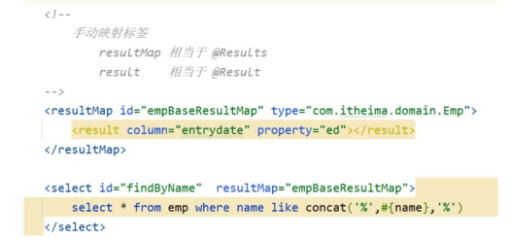
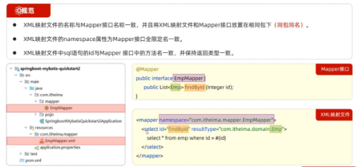
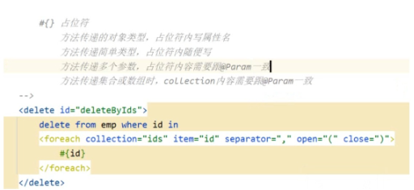
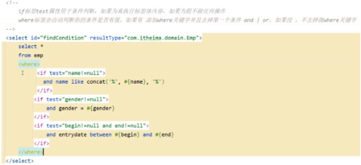
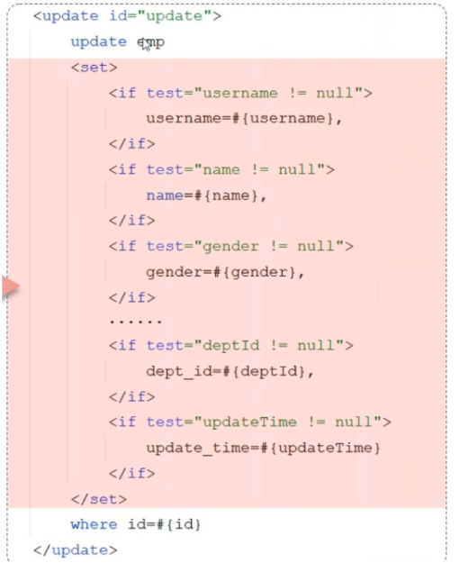
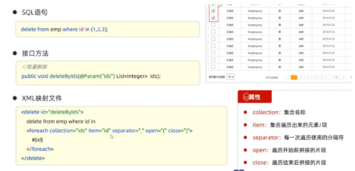
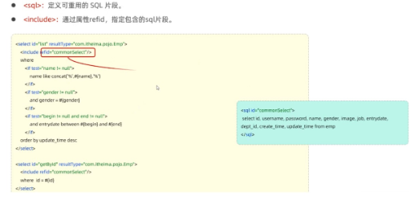

# Mybatis

> Mybatis是一个持久层框架，用于实现向数据库发送SQL语句，实现增删改查

## 开始
ORM: 对象关系映射。以操作对象的方式来操作数据表
## Mybtais怎么映射字段名？
实体类属性名和数据库表查询返回的字段名一致的话，mybatis会自动封装，如果不一致，就不会自动封装。

如果字段名与属性名符合驼峰命名规则，mybatis会通过驼峰式命名自动映射。
## 怎么打开驼峰自动映射？
在mybatis的配置文件.xml中打开：
~~~
<settings>

<setting name ="mapUnderscoureToCamelCase" value="true"/>

</settings>
~~~
## 解决不符合驼峰映射：
1 : 加别名 比如数据库名字是entrydate，实体类名是ed
~~~
select * ,entrydate as ed from emp; 
~~~
2 : 交给框架帮我们映射，通过@Resultes及@Ressult进行手动结果映射，但是如果用xml映射的话，就不能和这个注解混合用了
~~~
@Select("select * from emp")
@Results({

@Result(column ="数据库字段名"，property="实体类字段名"),

 …………

})
~~~
3 ：用xml手动映射

4 : 用MybatisPlus 的注解
## 解决用${}sql注入的问题
可以用concat()函数来做字符串拼接,执行的时候会把左右的占位符拼接,count(‘%’,’张’,’%’)
## 复杂的sql可以写在xml映射文件中

注意：不支持方法重载，mapper不能起两个同名的方法名 ### 动态sql 随着用户输入的外部条件变化而变化的sql语句，称为动态sql。 
比如前端可以根据名字，性别，时间搜索，但是要是只搜索名字，不搜索其他，我们就不需要查询其他，所以要在xml里面动态拼接sql。

如果传入的值为空，就不查询，如果不为空，就执行查询：

根据id更新字段，只更新名字，传谁就更新谁：

批量删除，选谁删谁，用到,相当于遍历，你传入什么值，这边就记录什么值，最后执行

如果有多个查询语句，有公共代码，需要解耦，可以把公共代码写到sql片段中

每次连接都要去数据库，太影响性能了，我们可以设置数据库连接池，每次用的时候去连接池取，用完归还就可以了，接口DataSource，目前用的最多的是两个技术，阿里巴巴的Druid(功能强大)和日本的HikariCP(性能好，SpringBoot默认内置连接池)

