# Spring

> IOC、AOP、MVC、SpringBoot

## Spring主要功能
IOC:控制反转

AOP:面向切面编程

MVC：开发web应用程序

事务：无需编写代码，即可实现数据库事务管理
## SpringIOC
控制：对象创建权交给SpringIOC容器

反转：对象的创建由程序员在类中主动创建反转到由Spring容器来创建，说白了就是原来是我程序员创建对象，我不创建了，反转给你创建

SpringIOC的核心思想是解耦。正常调用另一个对象的话需要new一个对象建立关系。我们可以把创建对象交给IOC容器来做，用的时候从IOC里面取就可以了

@Configuration 表示当前是一个Spring的配置类

@ComponentScan 告诉Spring在项目启动时，扫描包下所有类是否由IOC注解，如果有就创建对象

@Component 在类上标注这个注解，IOC就会自动创建这个对象

为了更好识别你导入的类是哪个层，可以有三个子注解：

@Controller 标注在表示层的类上 @Service 标注在业务层的类上 @Repository 标注在持久层的类上

@Autowired依赖注解会去IOC容器中找有没有找个对象

@Primary 指定@Autowired用哪个对象，在类上加这个注解

@Bean 如果引入的是第三方的包，就用这个注解引入，比如向Spring容器中放入DruidDataSource对象
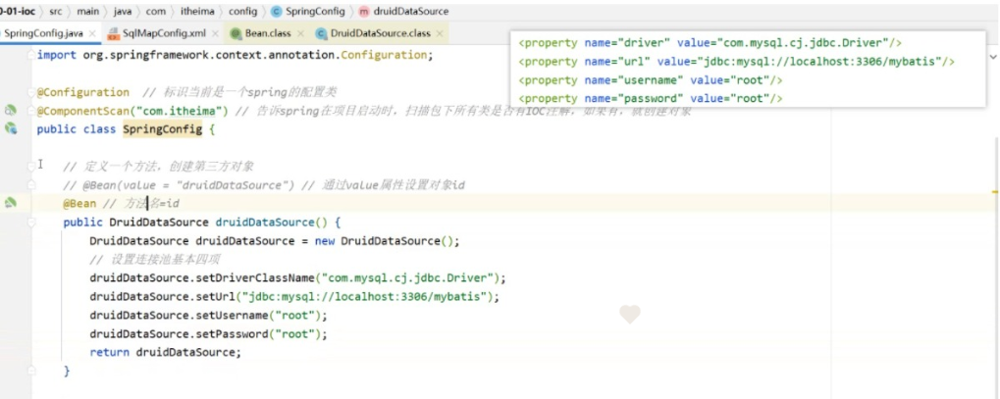
## 获取代码执行前后的时间
可以在代码执行前后添加日志，执行前添加一段日志打印时间，执行后添加一段代码打印时间，但是这样的话耦合性和复用性高，我们需要优化一下。

可以使用JDK动态代理，新建一个对象，要求和目标对象实现同一个接口（兄弟关系），然后在对象中增强，

如果被增强的对象没有接口，那么就需要第三方的技术CgLib动态代理，目标对象是父类，代理对象是子类。

两个以上的方法要做通用的操作，我们就可以用动态代理来做增强，这种思想统称为AOP（面向切面编码），目的是在不修改源代码的基础上，对原有功能进行增强

SpringAOP框架：目标对象（被代理对象），连接点（目标对象中的所有方法），切入点（目标对象中要进行增强的那部分方法），增强（具体增强的功能），切面（增强方法和切点方法的执行顺序）
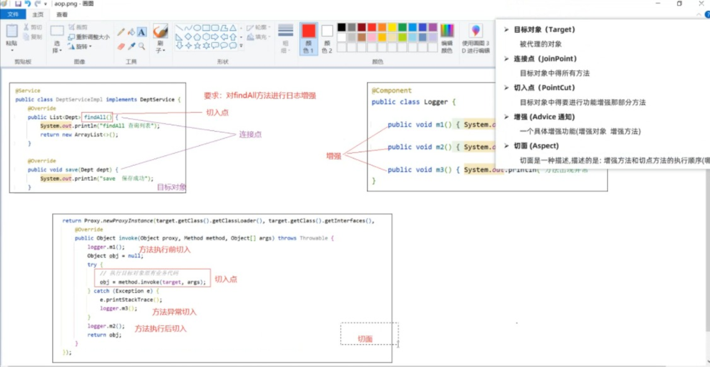
## SpringAOP怎么用？
1： 在配置类上开启AOP注解支持 @EnableAspectJAutoProxy

2：在增强类上添加切面注解@Aspect，然后在增强的方法上添加注解@Before（”execution(方法的全限定名+增强的方法全路径名)”），可以用切点表达式来控制增强的方法

或者用自定义注解，哪个方法上标记了注解，哪个方法就可以增强（自定义一个注解，然后在需要增强的方法上添加此注解，之后再动态代理类上告诉@Pointcut(“@annotation(自定义注解的全限定名)”)）
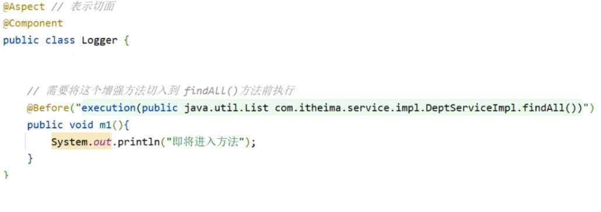
3：如果还有要增强的话，表达式要写很多个，我们可以抽取切点表达式
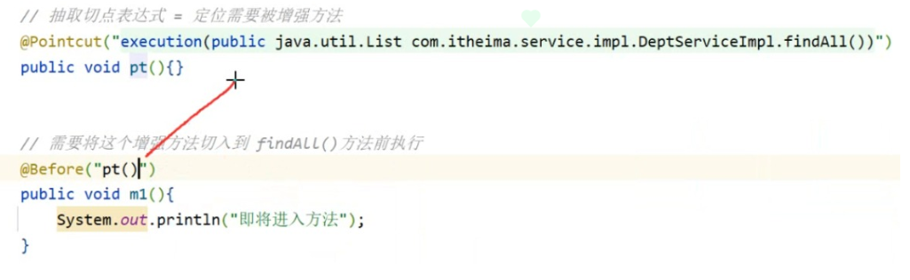
4：指定在方法前后或者异常时通知
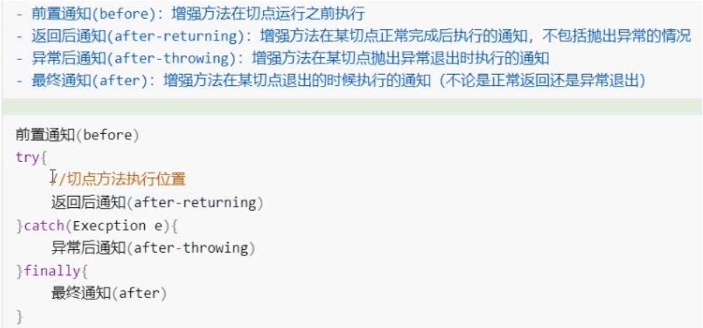
或者使用比较灵活的环绕通知：使用注解@Around
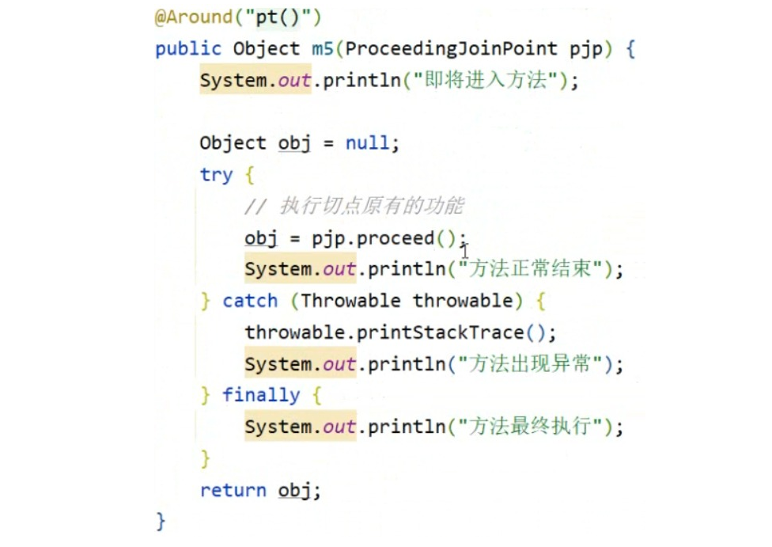
如果只在一个地方增强，建议用普通的四大通知一种，如果都要增强，可以用环绕通知
5：如有一个方法要多次增强，比如要在前置通知，又要打印日志，又要增强其他，哪个在前哪个在后呢？

可以在动态代理类上使用注解@Order（数字），数字越小，优先级越高
## SpringAOP怎么开启事务？
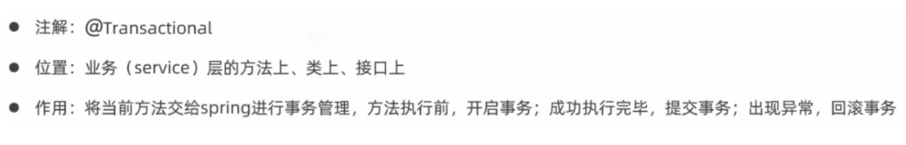
## 什么是Spring事务的传播行为？
首先事务传播时是为了解决业务层方法之间互相调用的事务问题。当事务方法a被另一个事务方法b调用时，这个事务方法应该如何进行？，该用a的事务呢还是b的事务呢？，如果a事务失败了，b也跟着失败吗？，这里我们就可以自己控制事务传播行为。
spring支持通过配置的形式类实现7种事务传播行为，默认的是REQUIRED（瑞快儿特） ，有的话就加入，你成功我也成功，你失败我也失败，没有的话自己就新建一个，用我自己的。或者我们可以创建一个REQUIRES_NEW，有没有我们都会新建一个，我们可以对不用的场景用不同的事务传播行为
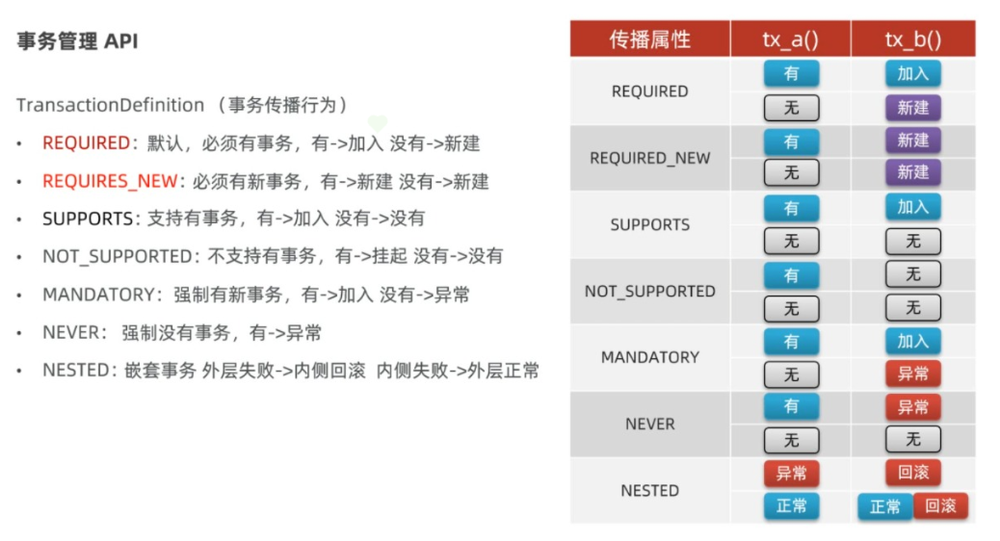
## 什么是SpringMVC？
SpringMVC是将Servlet一些通用功能进行了抽取和封装，说白了就是Servlet（Servlet是服务器端的一个组件，常被用来处理HTTP请求和响应，生成动态的Web内容，比如HTML、XML、JSON等）的框架

由两部分组成：前端控制器和处理器，前端控制器只要负责接收参数和返回数据。处理器就是我们编写的地方，主要负责参数处理和业层调用，说白了就是我们在处理器调用业务层代码后返回到前端控制器，前端控制器帮我们处理参数的调用返回，底层也是抽取封装了原来Servlet的代码
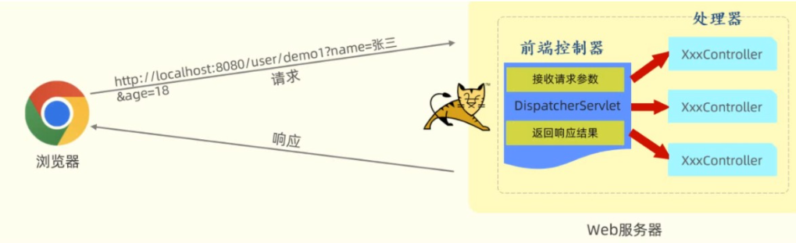
前端控制器是怎么运行的：1：解析请求，获取访问路径和参数 2：根据路径寻找对应的Controller方法，如果方法需要参数，给予变量赋值 3：接收Controller方法返回值，将对象转换为JSON后响应到客户端
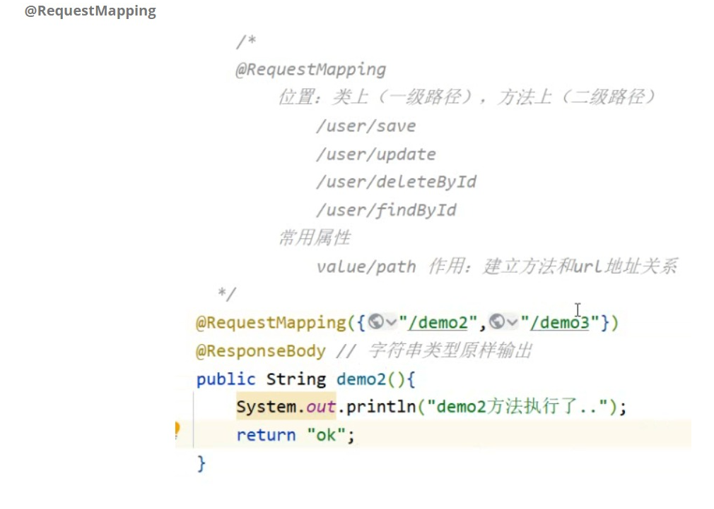
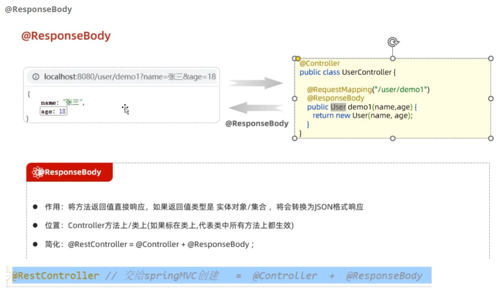
正常接收前端参数，如果是简单类型，直接写就可以了
如果有好几个对象，我们可以设置一个类，把需要接收的值写到对象中，然后直接在形参上写对象类型就可以了
如果是数组类型，直接标记数组类型就可以
同样用list就可以用list集合接收，但是要加一个注解@RequestParam，用来告诉SpringMVC，多个参数使用list集合接收
接收日期类型默认格式是（yyyy/MM/dd）国内使用（yyyy-MM-dd）所以这里需要使用注解@DateTimeFormat(“yyyy-MM-dd”)
接收POST请求体，Body的JSON对象，我们需要用注解@RequestBody（请求体中处理JSON，然后转换为指定的对象）
路径传参的话需要用注解@PathVariable（”{}”）
如果前端没传值，我们可以可设置一个默认值@RequestParam(defaultValue = “默认值”)，也可以加别名
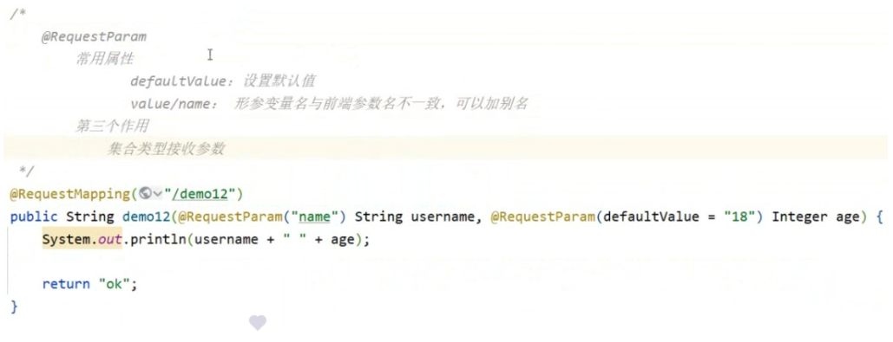
## 怎么统一处理异常？
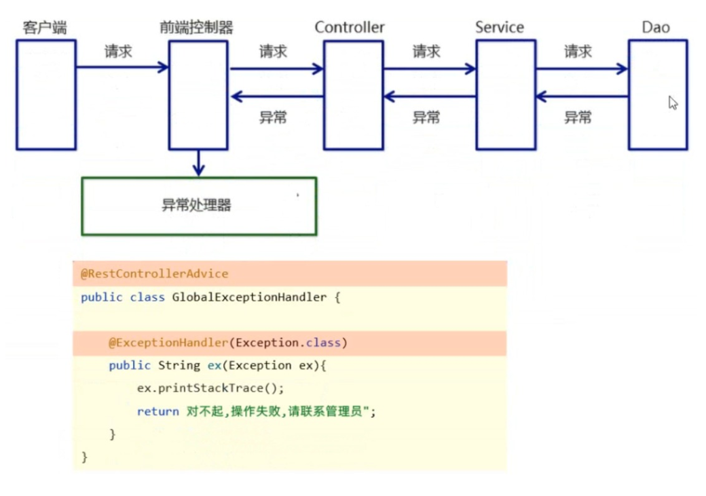
Spring提供了一个异常处理器，我们自定义一个全局异常处理类

1：类上添加注解@RestControllerAdvice

2：指定捕获什么异常，在方法上添加注解@ExceptionHandler(Exception.class)
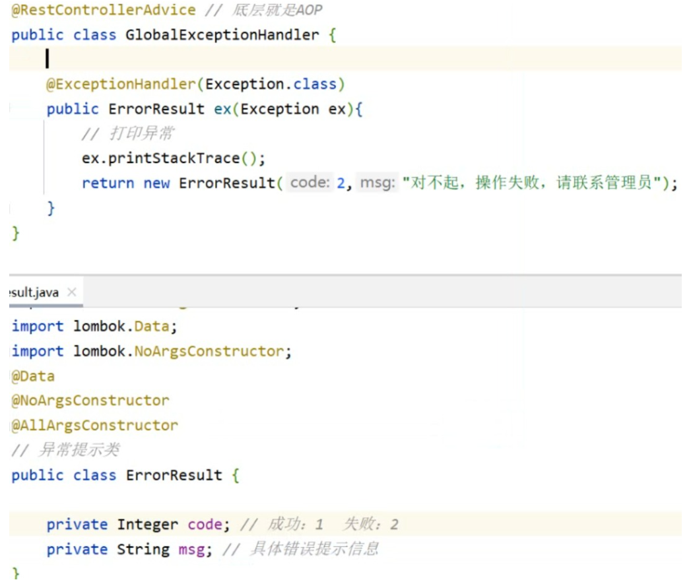
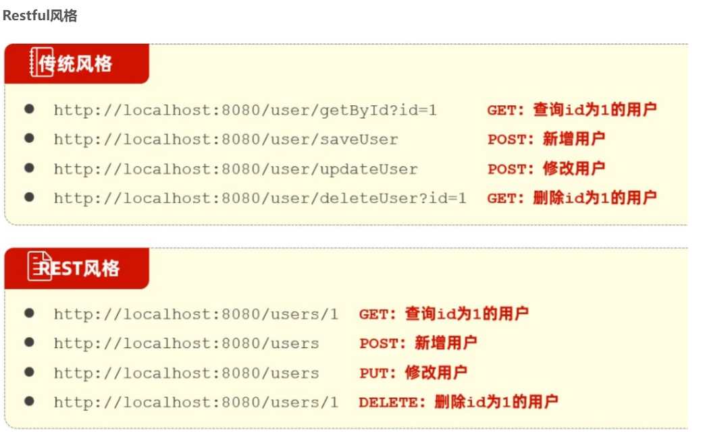
## SpringBoot
约定优于配置，版本锁定（父工程中内部锁定了部分依赖的版本号），起步依赖，自动配置，内置Tomcat

启动类添加注解@SpringBootApplication（标记这是一个启动类）

@MapperScan（）mybtais包扫描，创建代理对象

自定义配置文件
## Spring日志保存持久化：
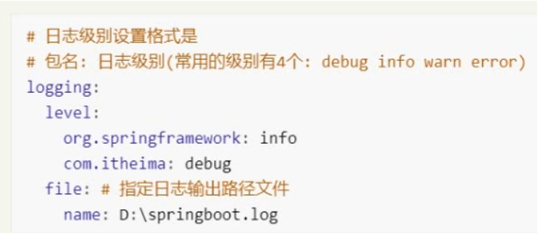
在类上标记注解@slf4j ，有四种级别

log.debug(); 记录便来给你调试查看使用

log.info(); 记录程序运行信息

log.warn();记录警告信息

log.error();记录错误信息

优先级是从上往下，如果设置第一个debug，就会显示下面所有的信息
## 统一返回结果：
返回结果不同，有的是普通字符，有的是集合，不方便管理，所以这里我们定义一个统一返回结果的类
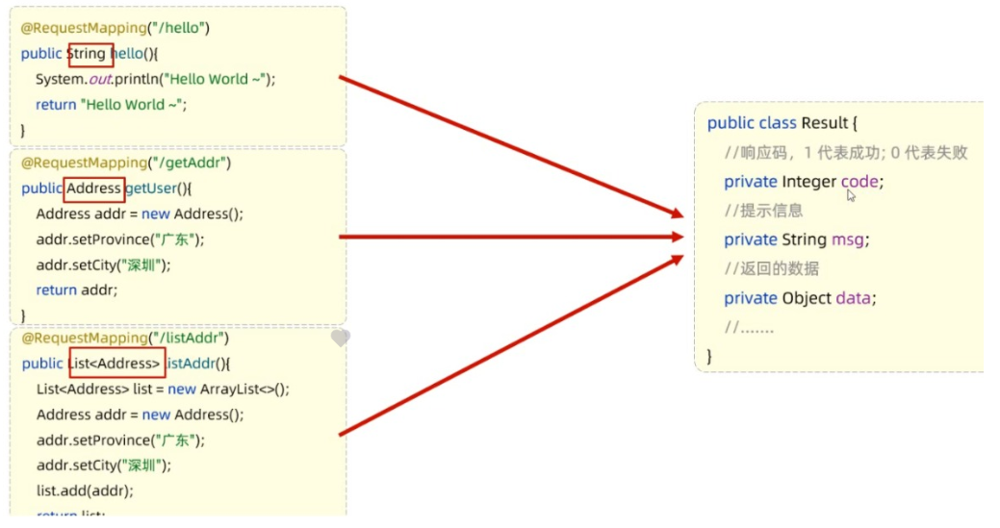
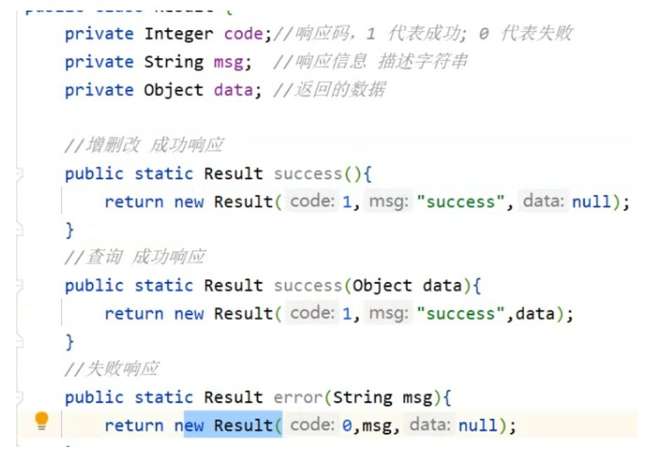

