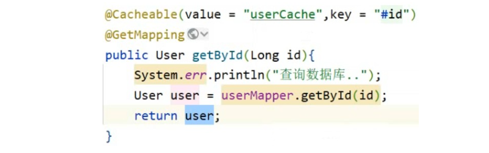
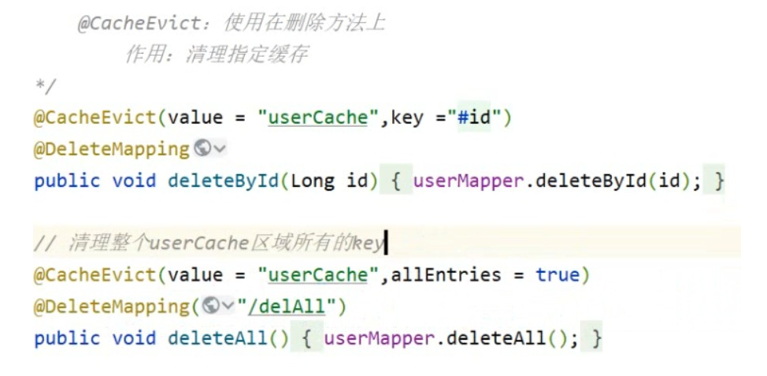

# SpringCache

> SpringCache是一个框架，实现了基于注解的缓存功能

## 开始
添加依赖~
@EnableCachaing 放在启动类上，用于开启基于注解的缓存

@Cacheable 放在查询方法上， 方法执行前先看是否有缓存，如果有直接返回，如果没有，去后台查询方法并添加到缓存中

@CacheEvict 清空缓存

@CahePut （了解）

属性： value 用于指定缓存内存区域名称（可以理解为定义一片区域用于存储缓存）
key 用于指定缓存数据的key，支持SPEL表达式（存储用户的id） 参数名称里面的id
在方法上添加缓存@Cacheable(value=”UserCache”,key = “# user.id”/或者 “result.id”)

@CacheEvict 清理一个或所有

