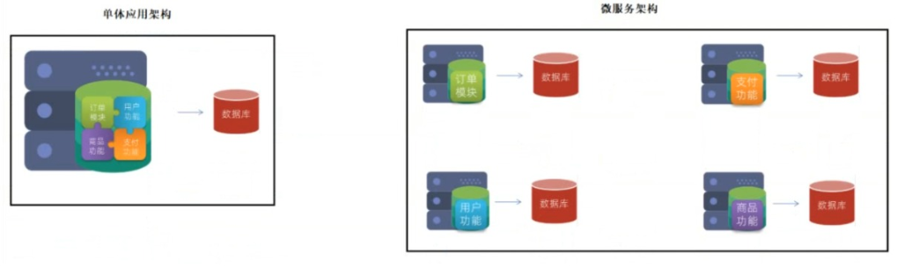
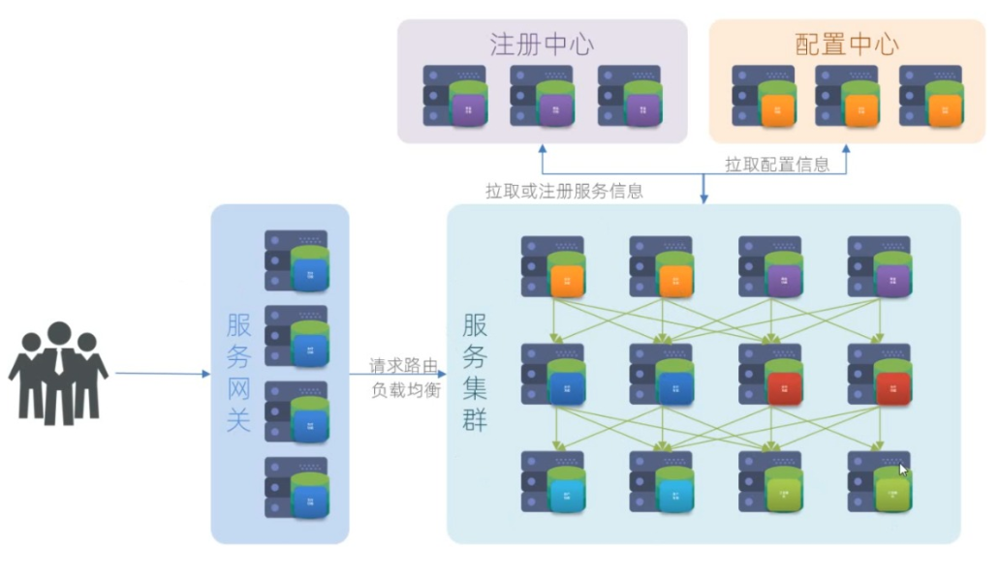
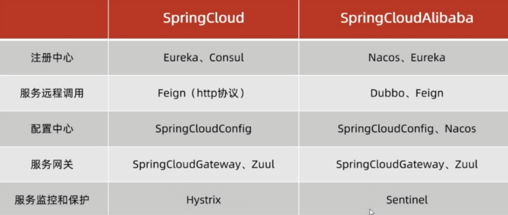
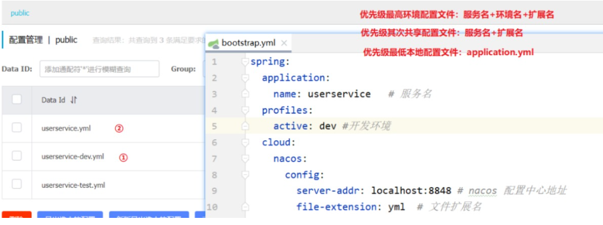
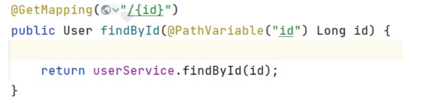

# SpringCloud

> 负载均衡、Nacos、Feign、熔断器、网关、断言

## 学前了解
单体应用架构是把所有应用模块放一起，用的时候都去数据库调用，如果数据库崩了，就会影响所有的模块运行。

微服务架构是把应用模块分成好几个各自的模块，每个模块都有各自的数据库，用的时候互相调用即可，如果有一个模块崩了，不用影响其他模块运行，大大提高了容错率。


有了思想，就需要有技术框架方案落地，全球最知名的有SpringcCloud NetFlix和 SpringCloud Alibaba。

现在已经把应用模块分成了好几个，但互相调用比较麻烦，所以在此基础上，可以创建一个服务注册中心，专门用来管理各个模块。
同时每个模块也需要有各自的配置信息，模块微服务要调用后台的开发环境或测试环境，就要修改配置文件，比较麻烦，所以我们需要创建一个配置中心,一处修改，多处调用


完成微服务方案需要很多组件一起来完成，这些组件要依赖springboot，要不然配置比较麻烦


各个模块区分了，如果你要调用另一个模块，就要像浏览器那样发送http请求

以前用的是httpClient，用起来虽然比较方便，但是代码多，这里我们用另一个

RestTemplate（spring-web内部已经提供了，不需要单独导入）

我们需要把他定义到springioc容器中，因为启动类就是配置类，我们a要调用b，所以就在a的启动类中定义@Bean注解，把RestTemplate放入springioc容器中\
```
@LoadBalanced // 开启负载均衡
@Bean // 创建代码交给ioc容器 
public RestTemplate restTemplate(){
    return new RestTemlate();
}
```
通过@Autowired导入restTemplate，然后调用b，需要给b发送请求
```
// 向b发送请求调用的地址
String url = "http://localhost:xxxx"+a.id;
//给b发送请求调用。b接收请求后返回的是json格式，java不能直接接收json格式，需要把json转换成对象
restTemplate.(这里发送什么请求就输入什么请求).getForObject(url,a.class)
```
a调用b，a就是消费者，b就是提供者，同理，谁调用谁谁就是消费者，提供信息的就是提供者！

如果a调用b的时候，b挂了，就不能正常执行了，所以需要多台服务器，比如b1，b2，……

这个时候就需要用到注册中心，假设消费者要调用提供者，提供者可以把自己所有的服务器都放在一个叫“注册中心”的地方统一管理，通过注册中心来告诉消费者，提供者哪一台服务器是健康的，哪一台是坏的

### 那么问题来了
#### 问题1:如果a用url地址去调用b，b有多个服务器，a怎么选择调用哪个服务器呢？
a要调用b，但可能也有c要调用a，所以自己既是消费者，也是提供者。比如这里a调用了b，把b的所有服务器都从注册中心拉取下来，但有多个服务器，要用哪个呢？选择的过程就叫负载均衡，默认是轮询，比如请求先调用b，再调用b1,……
#### a调用b的时候，怎么获取b的地址信息呢？
找注册中心要。
#### 问题3：a怎么知道b哪一台服务器是好的是坏的？
b有个心跳续约的过程，会每30秒向注册中心上报自身健康信息，如果b有个服务器挂了，注册中心知道后，就会告诉消费者a，然后a就不会再调用b挂了的服务器
#### 问题4：b的各个服务器怎么知道自己是好的是坏的？
b有个心跳续约的过程，会每30秒向注册中心上报自身健康信息
#### 问题5：开启负载均衡后，默认的是轮询，怎么更换？
可以调用java代码更换，但是如果调用的多了，就比较麻烦。如果a调用b，负载均衡用的轮询， a再调用c，要求用循环的话，java代码就不好用了，这里就可以用配置文件
#### 问题6：怎么提高访问速度
饥饿加载，第一次调用的时候就创建好，下次调用直接用就可以了，就不用再次创建
```
ribbon:
  eager-load:
    enabled: true # 开启饥饿加载
    clients:
      - userservice  # 指定饥饿加载的服务名称
```
#### 问题7：怎么自定义设置负载均衡规则
可以用java代码，也可以在配置文件中，两个不能一起
```
userservice: # 给某个微服务配置负载均衡规则，这里是userservice服务
   ribbon:
     NFLoadBalancerRuleClassName: com.alibaba.cloud.nacos.ribbon.NacosRule # 负载均衡规则
```
Nacos  
打开Nacos安装目录，在bin目录下执行，访问网页http://localhost:8848/nacos 账号密码都是nacos
```
startup.cmd -m standalone
```
把模块放入Nacos管理
导入依赖：
```
<!--nacos注册中心客户端依赖-->
<dependency>
    <groupId>com.alibaba.cloud</groupId>
    <artifactId>spring-cloud-starter-alibaba-nacos-discovery</artifactId>
</dependency>
```
添加配置文件：
```
spring:
  cloud:
    nacos:
      discovery: // 注册中心地址
        server-addr: localhost:8848 # 连接nacos注册中心
```
Nacos设置负载均衡的权重，权重就相当于你的等级大小，官方建议在0~1之间设置
#### 问题8：如果访问途中，有100个b的实例，挂了99个，只剩下一个，会怎么样？
如果所有请求都去访问一个实例服提供者，会造成雪崩，比如有100个b，挂了99个，那么消费者都会去访问剩下的1个，剩下一个承受不了压力，就会导致最后系统瘫痪，所以要设置一个阈值，就是比如有100个服务器，设置假如挂了50台，就自动开启保护阈值，之后消费者访问的时候就按照比例，一半人访问成功，一半人访问失败，来缓解提供者的压力，从而能让剩下的提供者能正常工作。

保护阈值触发条件为：（实际健康实例/总服务实例）<=设置的保护阈值

比如健康实例为1个，服务实例为2个 1/2=0.5 设置保护阈值=0.5

#### 问题9：每个微服务都要调用nocos中配置的配置文件，怎么调用？
在nocos中配置好配置文件，然后在项目中创建优先级比application.yml高的bootstrap.yml引导配置文件
```
spring:
	application:
		name: userservice   # 服务名
	cloud:
	  nacos:
 		config: // 配置中心地址
   		  server-addr: localhost:8848 # nacos 配置中心地址
   		  file-extension: yml  # 文件扩展名
```
之前的是注册中心的依赖，这里也要引入配置中心的依赖
```
<!--nacos配置管理依赖-->
<dependency>
 <groupId>com.alibaba.cloud</groupId>
 <artifactId>spring-cloud-starter-alibaba-nacos-config</artifactId>
</dependency>
```
这里nacos配置要是改变了的话，微服务就要重新启动才能生效，重启期间用户不能正常访问，非常不友好，我们可以设置自动刷新，新建一个配置属性类
```
@Data
@Component
@ConfigurationProperties(prefix = "jdbc") //批量读取
public class MyJdbcProperties {

private String username;
private String password;
}
```
#### 问题10：如果nacos和本地配置文件同名会怎么样？
先入为主，谁的优先级高就会先读取谁的，如果nacos里面有了，会读取nacos里面的，就不会读取本地配置文件里面的了

#### 问题11：当不同环境具有相同配置，，这些配置在每个环境的配置文件中都配置了一份，此时出现了重复配置如何只配置一次，还能在多个环境中共享配置呢？
微服务启动时，会去nacos读取 2 个配置文件，例如：
- 环境配置：例如：userservice-dev.yml
- 共享配置： 例如：userservice.yml

而userservice.yml不包含环境，因此可以被多个环境共享。
然后修改配置文件
```
spring:
  application:
    name: userservice   # 服务名
  profiles: //在这里指定开发环境
      active: dev # 指定具体的环境
  cloud:
    nacos:
      config:
        server-addr: localhost:8848 # nacos 配置中心地址
        file-extension: yml  # 文件扩展名
```
#### 问题12：配置文件优先级是什么？

问题13：如果nacos挂了怎么办？
这里可以弄一个集群，设置好几台nacos实例，客户端去连接Nginx(负载均衡服务器)来调用nacos实例，同时nacos实例1里面的配置文件设置持久化，Nginx(负载均衡)调用nacos实例2的时候，nacos去数据区取配置文件

#### 问题14： nacos和Eureka的区别
1· nacos具有配置中心的功能

2·nacos支持动态刷新

3·nacos可以根据业务和环境进行分组管理，做到隔离

4·nacos可以设置权重

5·nacos支持在线管理，eureka只能预览

#### 问题15：微服务之间调用的代码不统一，参数复杂的地址难以维护，有什么好的办法吗？
可以用 Feign来代替Resttemplate,谁发请求，谁使用Feign
导入坐标依赖
```
<dependency>
    <groupId>org.springframework.cloud</groupId>
    <artifactId>spring-cloud-starter-openfeign</artifactId>
</dependency>
```
在消费者的启动类上标注注解
```
@EnableFeignClients //用于开启Feign的功能
```
声明一个远程调用的接口，名字一般叫 模块名+Client，之后在接口添加注解
```
@FeignClient("这里写调用url地址")
```
然后在接口定义要接收的请求，对方的Controller怎么写，我们的Client就怎么写，比如对方是这个：

```
//我们这里就这样写
@FeignClient("userservice")
public interface UserClient {

    //  "http://userservice/user/"+id
    @GetMapping("/user/{id}")
    User findById(@PathVariable Long id);
}
```
之后修改消费者调用提供者的方法：直接把Client用@Autowired注入
```
调用Client.findById(xxx)
```
Feign支持自定义配置文件，可以用java代码，也可以用配置文件

比如说针对所有微服务做日志记录：
```
feign:  
  client:
    config: 
      default: # 这里用default就是全局配置，如果是写服务名称，则是针对某个微服务的配置
        loggerLevel: FULL #  日志级别 
```
每次发送请求都是新的连接，消耗资源，对于高并发不友好，我们可以创建个连接池，每次用的时候取连接池里面取。默认的是没有连接池的
导入依赖：
```
<!--httpClient的依赖内置连接池 -->
<dependency>
    <groupId>io.github.openfeign</groupId>
    <artifactId>feign-httpclient</artifactId>
</dependency>
```
配置连接池：
```
feign:
  httpclient:
    enabled: true # 开启feign对HttpClient的支持
    max-connections: 200 # 设置最大的连接数
    max-connections-per-route: 50 # 并行接收一个服务的请求数量
```
假如a访问b有100个人访问，连接池设置的也是100个。a再有人访问c的话，连接池就没有了，所以为了雨露均沾，要在每个微服务接收请求数量里面设置均匀的并行接收请求数量

假如a要调用b，c也要调用b。配置和实现接口都会重复调,就会出现代码重复。我们可以设置一个feign-api的公共组件，每次消费者使用的时候，直接从feign-api调用就可以了，避免了重复代码

#### 问题： 还有什么办法解决雪崩问题？
常用方式有 超时处理：设置超时时间，请求超过一定时间没有响应就返回错误信息，不会无休止等待，但是设置超时时间的话会影响性能，用户体验

熔断降级：如果第一次访问失败，就开启熔断，类似保险丝，烧断了以后就不会再工作了，告诉你这里不能再访问了。

流量控制：限制访问，设置个大门（Sentinel）控制流量，类似以前游戏登录，如果当天有活动，就会

开启排队机制，告诉你前面还有多少人，等处理完前面的请求再放你进去，一般用在抢票，秒杀抢购等

Hystrix（解决雪崩的一种解决方案组件）：
熔断： 提供者挂了，消费者就不在向提供者发送请求，这里可以设置阈值，比如100次里面有50次失败，就会开启阈值

降级：熔断后，给提供者返回默认值，可以是错误提示信息

开启Hystrix；(谁调用谁谁加)
```
feign:
  hystrix:
    enabled: true # 开启Feign的熔断功能
```
降级：设置一个实现类来实现远程调用的接口，如果调用的接口失败了，就异常处理，在feign-api模块中提供一种异常处理，然后在接口的@FeignClient注解后面添加地址，
确保能扫描到 (value=”这里写调用url地址”, 😀fallback=UserClientFallback.class)。之后再在消费者的启动类中添加@Import(UserClientFallback.class) 来手动导入指定类创建

断路器默认是关闭状态，打开断路器后阈值就会运行，但是如果挂了之后，不能就不再访问了，可以设置一个半开状态，等熔断时间过去了，再放行两个值，如果可以正常运行，就关闭熔断，如果还是访问失败，则继续打开断路器，在消费者配置
```
hystrix:
  command:
    default:
      circuitBreaker:
       requestVolumeThreshold: 10 //触发熔断的最小请求次数，默认20
       errorThresholdPercentage: 50 #异常比例 触发熔断的失败请求最小占比，默认50%
       sleepWindowInMilliseconds: 10000 //休眠时长，默认是5000毫秒
```
访问每个微服务都要写过滤器和拦截器用来权限校验和身份认证，我们可以把它写在登录口，网关（大门口）来简化公共重复的代码，如果符合条件放行，不符合条件直接返回

#### 问题：什么是网关？
用来身份认证和权限校验，也可以服务路由（转发） ，负载均衡， 请求限流

路由：路由就是转发，接收到请求后，帮你转发到微服务

断言：断言要和路由一起用，断言就是校验是否满足规则，比如你要找苹果，但我这只有香蕉，不符合规则，这个校验的过程就叫断言，说白了断言就是规则，路由就是转发

#### 问题: 网关思路有了，落地方案怎么实现？
gateway组件
注册一个模块，导入依赖,因为网关不知道微服务的每个地址，所以要找nacos要，这里也要把nacos依赖导入进来
```
<dependencies>
    <!--网关-->
    <dependency>
        <groupId>org.springframework.cloud</groupId>
        <artifactId>spring-cloud-starter-gateway</artifactId>
    </dependency>
    <!--nacos服务发现依赖-->
    <dependency>
        <groupId>com.alibaba.cloud</groupId>
        <artifactId>spring-cloud-starter-alibaba-nacos-discovery</artifactId>
    </dependency>
</dependencies>
```
网关也是个微服务，也需要连接注册中心，所以需要配置配置文件
```
server:
  port: 80 # 网关端口
spring:
  application:
    name: gateway # 服务名称
  cloud:
    nacos:
      server-addr: localhost:8848 # nacos地址
    gateway:
      routes: # 网关路由配置
        - id: user-service # 路由 ID，唯一
          # uri: http://127.0.0.1:8081 # 目标 URI，路由到微服务的地址
          uri: lb://userservice # 目标 URI，获取注册中心微服务地址，并支持负载均衡
          predicates: # 断言规则（判断条件）
            - Path=/user/** # 匹配对应的 URL 请求，调用 URI 对应的微服务来工作
        - id: Order-service 
          uri: lb://Orderservice 
          predicates:
            - Path=/Order/** 
            有几个微服务，下面就写几个
```
之后调用网关地址，先断言在转发，先看看断言规则里面有没有要的微服务，有的话就转发，没有就返回

#### 问题：断言规则常用的是路径规则，还有其他规则吗？
可以在断言工厂找：断言工厂

比如：After(某个时间点之后访问生效) ，比如说我要在2025年之后开服，之前不能访问

Before(某个时间点之前访问生效)，比如你要在1天后关闭这个网站，1天之前都可以访问，一天之后就不能访问了

Between（某个时间点之间访问）比如只能在工作日访问，节假日就不能访问了

RemoteAddr(指定ip范围)，比如只能是中国的ip访问，外国不行

#### 问题：什么是过滤器，怎么配置？
过滤器就是用来身份认证和权限校验，在路由之后，断言认证后，路由转发的时候用到过滤器

过滤器工厂
比如这里在用户服务里面加一个过滤器：
```
spring:
  cloud:
    gateway:
      routes:
        - id: user-service 
          uri: lb://userservice 
          predicates:
            - Path=/user/** 
          filters: # 过滤器
            - AddRequestHeader=Truth, jian pan qiao lan xin zi guo wan! # 添加请求头
```
如果都要执行过滤器的话，就把滤器工厂写到default下。格式如下：
```
spring:
  cloud:
    gateway:
      routes:
        - id: user-service 
          uri: lb://userservice 
          predicates:
            - Path=/user/** 
      default-filters: # 默认过滤项
        - AddRequestHeader=Truth, jian pan qiao lan xin zi guo wan! 
```
#### 问题： 怎么自定义全局过滤器
在网关模块中定义一个类，实现接口GlobalFilter，然后实现里面的方法，最后放在spring容器中就可
比如有一个需求：

需求：定义全局过滤器，拦截请求，判断请求的参数是否满足下面条件：
- 参数中是否有authorization
- authorization参数值是否为admin
- 如果同时满足则放行，否则拦截
```
@Component
public class AuthFilter implements GlobalFilter, Ordered {

    /*
        exchange=request+response
        chain=过滤器链
     */
    @Override
    public Mono<Void> filter(ServerWebExchange exchange, GatewayFilterChain chain) {
        System.out.println("AuthFilter执行了...");
        // 1.获取request对象
        ServerHttpRequest request = exchange.getRequest();
        // 2.获取authorization参数
        String auth = request.getQueryParams().getFirst("authorization");
        // 3.判断拦截
        if (auth == null || !auth.equals("admin")) {
            // 设置状态码401
            exchange.getResponse().setStatusCode(HttpStatus.UNAUTHORIZED);
            // 响应拦截结果
            return exchange.getResponse().setComplete();
        }
        // 4.放行
        return chain.filter(exchange);
    }

    @Override
    public int getOrder() {
        return 2;
    }
}
```
#### 问题：如果有多个过滤器，谁先执行，谁后执行？
可以实现Ordered接口，实现里面的方法，数值越低，优先级越高！ 如果是负数，肯定第一个执行。


