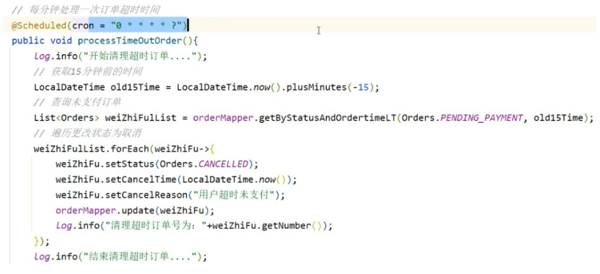
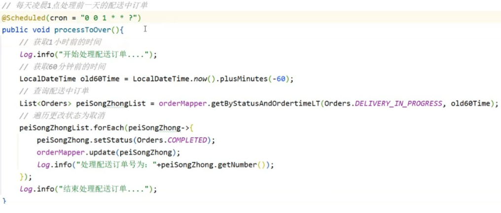

# SpringTask

> Spring 框架内置的一个轻量级任务调度和异步执行模块

## SpringTask：任务调度工具，可以按照约定的时间自动执行某个代码逻辑
在启动类上添加注解：@EnableScheduling 开启定时任务注解

方法上添加注解： @Scheduled(fixedDelay=”毫秒时间”) / @Scheduled（cron=”cron表达式”）
### 应用于用户下单后没有付款，我们可以设置一个定时任务
设置每分钟检查一次当前订单状态，如果为未支付，则修改为已取消

思路，用户下单后状态是待付款，过了15分钟之后，如果状态是未支付，就清理订单，所以这里要获取15分钟前的时间，LocalDateTime.now().plusMinutes(-15); 查询15分钟前订单状态为未支付的，就是未支付订单，然后清理订单

每天凌晨1点解决上一天的订单，如果状态为派送中，则修改为已完成

