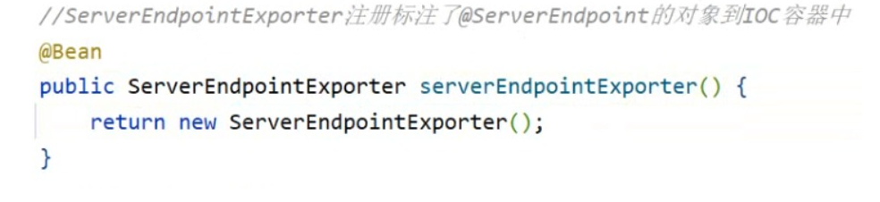

# WebSocket

> http通信时单向的，先请求，后响应，而WebSocket时双向通信，没有请求也可以响应，双向通信，实时响应，适用于高实时的的场景，需要服务器主动给客户端推送数据

## java使用Websocket
导入坐标，注册服务器端对象到ioc容器


我们服务器需要用一个map存会话对象，比如存手机号码，以后没有给我们发消息，我们可以根据地址主动给会话发消息
```
key    value
对象1   交房租啦
对象2   交房租啦
对象3   交房租啦    
```
比如我们可以通过定时任务，每隔一段时间发送一些数据，也可以群发，比如月底短信通知

也可以根据会话对象推送不同的数据，比如你是会员，我可以让你看所有电视，你是普通用户，只能看免费电视

或者弹幕，你输入数据存到后台后，后台实时通过WebSocket推送
```
/**
 * @ServerEndpoint 注解是一个类层次的注解，它的功能主要是将目前的类定义成一个websocket服务器端,
 * 注解的值将被用于监听用户连接的终端访问URL地址,客户端可以通过这个URL来连接到WebSocket服务器端。
 */
@Component
@Slf4j
@ServerEndpoint("/ws/{cid}")
public class WebSocketServer {

    //存放会话对象
    private static Map<String, Session> sessionMap = new ConcurrentHashMap();

    /**
     * 连接建立成功调用的方法
     */
    @OnOpen
    public void onOpen(Session session, @PathParam("cid") String cid) {
        System.out.println("客户端：" + cid + "建立连接");
        sessionMap.put(cid, session);
    }

    /**
     * 连接关闭调用的方法
     * @param cid
     */
    @OnClose
    public void onClose(@PathParam("cid") String cid) {
        System.out.println("连接断开:" + cid);
        sessionMap.remove(cid);
    }


    /**
     * 监听客户端发送过来的消息
     * @param message 客户端发送过来的消息
     * @param cid 客户端ID
     */
    @OnMessage
    public void onMessage(String message, @PathParam("cid") String cid) {
        System.out.println("收到来自客户端：" + cid + "的信息:" + message);
    }

    /**
     * 群发消息
     * @param message
     */
    public void sendToAllClient(String message) {
        Collection<Session> sessions = sessionMap.values();
        for (Session session : sessions) {
            try {
                //服务器向客户端发送消息
                session.getBasicRemote().sendText(message);
            } catch (Exception e) {
                e.printStackTrace();
            }
        }
    }
}

```
获取后发送：
```
@Component
public class WebSocketTask {
    @Autowired
    private WebSocketServer webSocketServer;

    /**
     * 通过WebSocket每隔5秒向客户端发送消息
     */
    // @Scheduled(cron = "0/5 * * * * ?")
    public void sendMessageToClient() {
        webSocketServer.sendToAllClient("这是来自服务端的消息：" + DateTimeFormatter.ofPattern("HH:mm:ss").format(LocalDateTime.now()));
    }
```
应用：来单提醒，客户催单~
用户支付后，商户收到提醒，可以下单啦

在订单支付成功后，发送消息给客户端
```
@Autowired
private WebSocketServer webSocketServer;

// 订单支付
public OrderPaymentVO payment(OrdersPaymentDTO ordersPaymentDTO) throws Exception {

    // 1.直接修改订单状态
    Orders ordersDB = orderMapper.getByNumber(ordersPaymentDTO.getOrderNumber());

    // 根据订单id更新订单的状态、支付方式、支付状态、结账时间
    Orders orders = Orders.builder()
        .id(ordersDB.getId())
        .status(Orders.TO_BE_CONFIRMED)
        .payStatus(Orders.PAID)
        .checkoutTime(LocalDateTime.now())
        .build();

    orderMapper.update(orders);


    //--------- webSocket 发送消息给客户端 ------------
    Map map = new HashMap();
    map.put("type", 1);//消息类型，1表示来单提醒
    map.put("orderId", orders.getId());
    map.put("content", "订单号：" + ordersPaymentDTO.getOrderNumber());
    //通过WebSocket实现来单提醒，向客户端浏览器推送消息
    webSocketServer.sendToAllClient(JSON.toJSONString(map));//转换为json
    //--------- webSocket 发送消息给客户端 ------------


    // 2. 返回一个空结果
    return new OrderPaymentVO();
}
```


