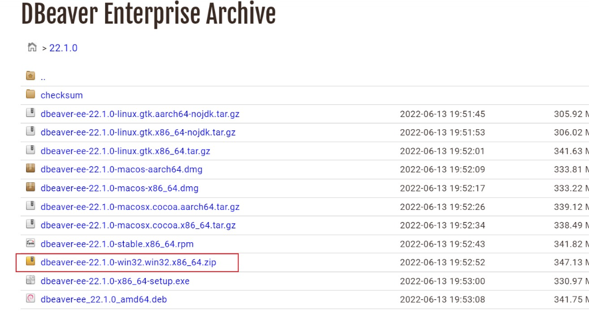
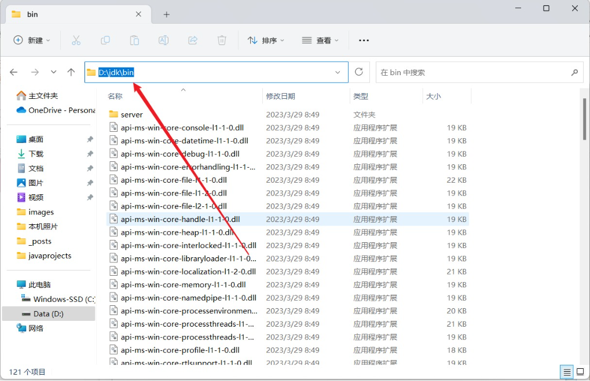
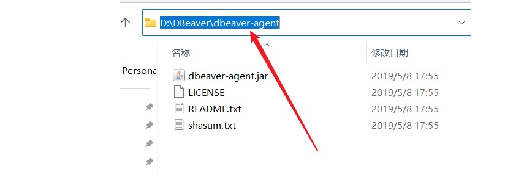
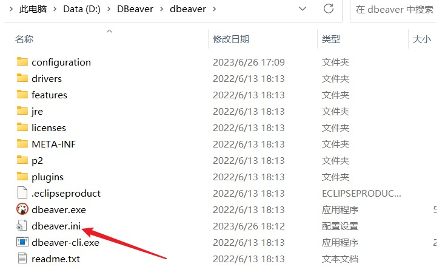
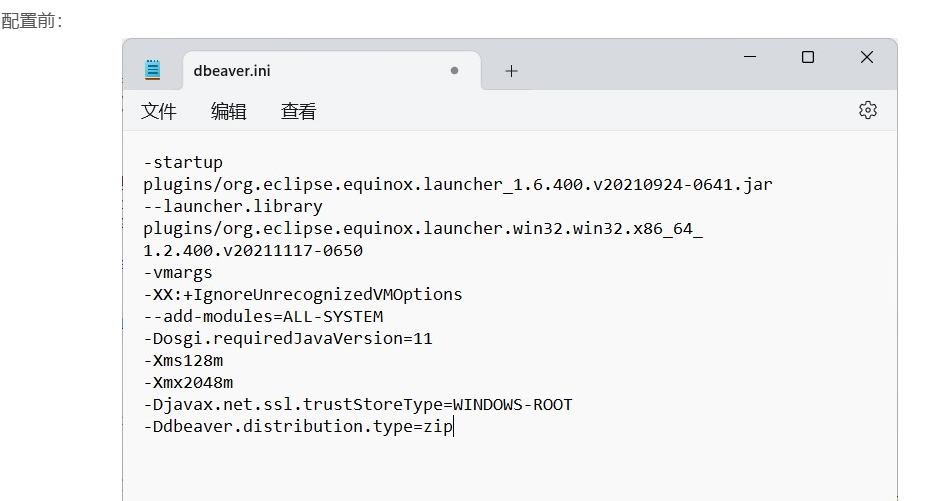
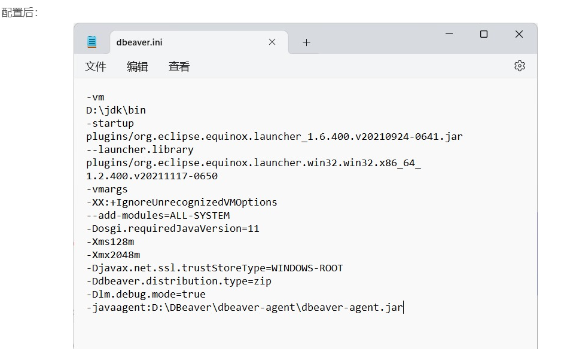

# 潘多拉

> 潘多拉宝盒

## 开始
• [廖雪峰](https://liaoxuefeng.com/)  
• [打字练习](http://www.daziba.cn/dzlx/)  
• [打字游戏](https://zty.pe/)  
• [极客教程](https://geek-docs.com/)  
• [若依框架](https://www.ruoyi.vip/)  
• [Easy Excel](https://easyexcel.opensource.alibaba.com/)  
• [大学资源网](https://www.dxzy163.com/)  
• [医学微视](https://www.mvyxws.cn/)  
• [清澄漫语 一个动漫众评小站](https://hzy.pw/dm/index.html)  
• [microsoft microsoft使用技巧](https://support.microsoft.com/zh-cn/windows)  
• [wikihow 生活指导手册](https://zh.wikihow.com/%E9%A6%96%E9%A1%B5)  
• [科学上网](https://github.com/shadowsocks/shadowsocks-windows/releases)  
• [科学上网](https://www.lanzous.com/i9vh5da)  
• [科学上网](https://github.com/shadowsocks/ShadowsocksX-NG/releases)  
• [科学上网](https://github.com/shadowsocks/shadowsocks-qt5/wiki/Installation)  
• [科学上网](https://www.lanzous.com/i9vh5da)  
• [科学上网](https://apkpure.com/store/apps/details?id=cc.dingnet.yunfangp)  
• [科学上网](https://apkpure.com/wang-vpn-%E2%9D%A4%EF%B8%8F-free-fast-stable-best-vpn-just-try-it/com.findtheway)  
• [科学上网](https://sfcloud.live/auth/register)  
• [科学上网](https://stc-spades-beta1.com/auth/register)  
• [科学上网](https://kaolay.com/assets/auth/register.js)  
• [科学上网](https://drive.google.com/file/d/1SwPri33OdG2usGlEqdCXXoY1Kq0vA3vP/view)  
• [科学上网](https://lncn.org/)  
• [科学上网](https://fanqiangdang.com/)  
• [科学上网](https://ssrtool.us/)  
• [科学上网](https://www.wallmama.com/ssr/)  
• [科学上网](https://www.freevpnnet.com/)  

• [idea](http://idea.lanyus.com/)  
• [idea](https://soft.macxf.com/soft/3533.html)  
• [idea](https://paicoding.com/article/detail/210)  
• [idea](https://idea.javatiku.cn/)  
• [idea](https://www.javatiku.cn/ideaguide.html)  
• [程序员工具](https://www.cxy965.com/)  
• [linux镜像拷贝](https://etcher.balena.io/)  
win10激活工具 https://pan.baidu.com/share/init?surl=LN17qQ6C47KuAvssvPZPVg u6s4
office2007 https://pan.baidu.com/share/init?surl=DMvTgEpm8kcVnrVTxzNSxw jhdy
office2016 https://pan.baidu.com/share/init?surl=pa_doeh6PRXnL6loT-qdpA 48og
工具集合 https://tools.miku.ac/ 
在线工具 https://tool.lu/
简历模板 https://www.canva.cn/

DBeaver Enterprise 22.1 企业版激活方法（windows）
1:下载jar包
链接 https://pan.baidu.com/s/1l2X4g2PPtPqZGTf1uVij5A
提取码:1999
2：下载DBeaver22.1版本
https://dbeaver.com/files/22.1.0/

3：下载jdk11以上版本，记住路径
https://www.oracle.com/java/technologies/javase/jdk11-archive-downloads.html

jar包路径

4：下载好DBeaver后打开这个文件

5：在第一行添加-vm，然后第二行设置jdk的版本路径地址
~~~
-vm 
D:\jdk\bin   这里是jdk11bin目录下路径
~~~
在最后添加
~~~
-Dlm.debug.mode=true
-javaagent:D:\DBeaver\dbeaver-agent\dbeaver-agent.jar  刚才下载的jar包路径
~~~
这个jar包就是你刚才下载的jar包，前面路径配置绝对路径

电脑问题解决：https://tools.lenovo.com.cn/exeTools/detail/id/311/rid/6991522.html

