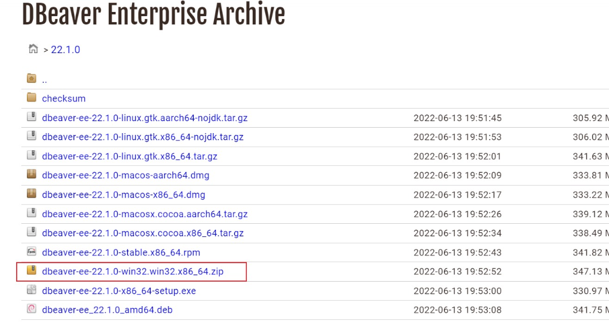
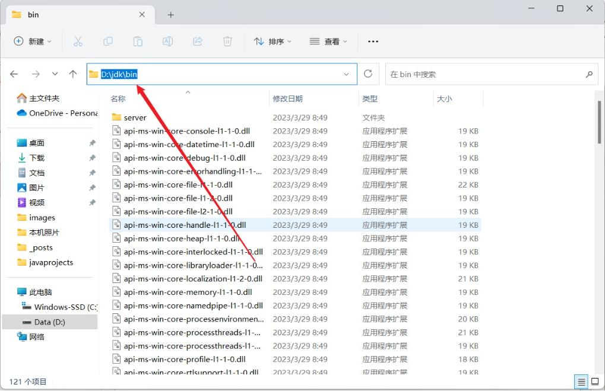
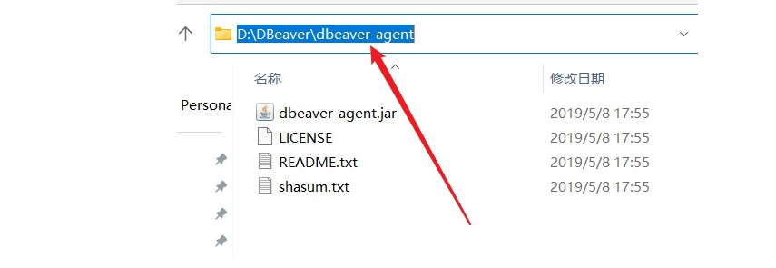
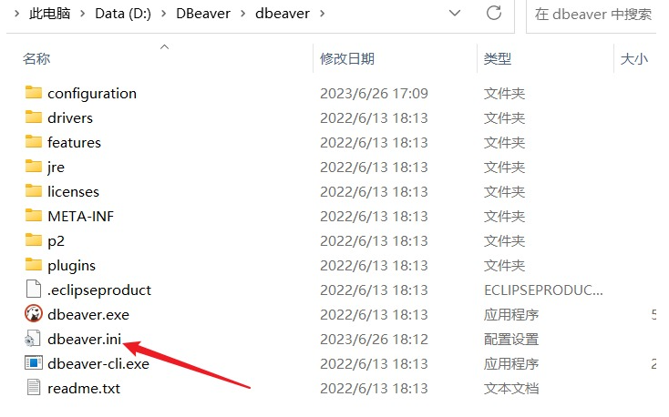
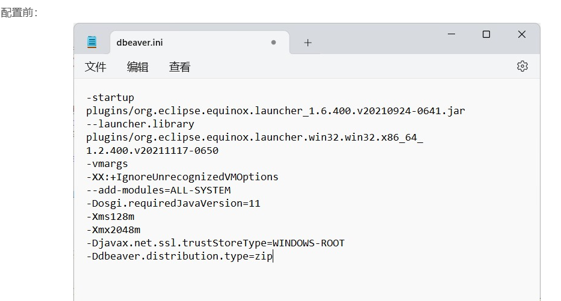
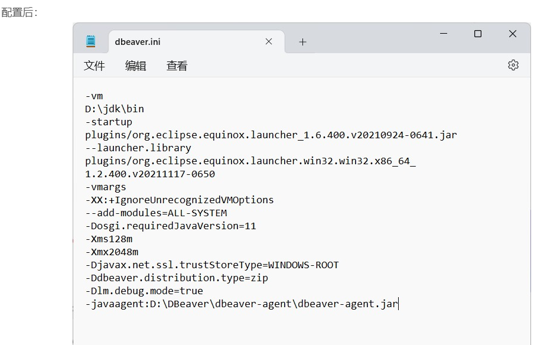

# 潘多拉宝盒 🎁

> 杂七杂八的好东西，不属于工具/影视/AI，但又值得收藏。

## 📖 学习资源

### **廖雪峰**
- [https://liaoxuefeng.com/](https://liaoxuefeng.com/)
> 老牌技术教程，Java、Python、JavaScript 等

### **极客教程**
- [https://geek-docs.com/](https://geek-docs.com/)
> 编程教程聚合

### **大学资源网**
- [https://www.dxzy163.com/](https://www.dxzy163.com/)
> 公开课、教材资源

### **若依框架**
- [https://www.ruoyi.vip/](https://www.ruoyi.vip/)
> Java 后台快速开发框架

### **Easy Excel**
- [https://easyexcel.opensource.alibaba.com/](https://easyexcel.opensource.alibaba.com/)
> 阿里巴巴 Excel 处理工具

### **医学微视**
- [https://www.mvyxws.cn/](https://www.mvyxws.cn/)
> 医学科普短视频

### **microsoft 使用技巧**
- [https://support.microsoft.com/zh-cn/windows](https://support.microsoft.com/zh-cn/windows)

### **wikihow 生活指导手册**
- [https://zh.wikihow.com/](https://zh.wikihow.com/)

---

## 🎮 趣味 / 练习

### **打字练习**
- [https://www.daziba.cn/dzlx/](https://www.daziba.cn/dzlx/)

### **打字游戏**
- [https://zty.pe/](https://zty.pe/)

### **清澄漫语**
- [https://hzy.pw/dm/index.html](https://hzy.pw/dm/index.html)
> 动漫众评小站

---

## 🛠️ 实用工具

### **程序员工具集合**
- [https://www.cxy965.com/](https://www.cxy965.com/)

### **工具集合 miku**
- [https://tools.miku.ac/](https://tools.miku.ac/)

### **在线工具 tool.lu**
- [https://tool.lu/](https://tool.lu/)

### **canva 简历模板**
- [https://www.canva.cn/](https://www.canva.cn/)

### **Etcher（Linux 镜像烧录）**
- [https://etcher.balena.io/](https://etcher.balena.io/)

### **联想电脑问题解决**
- [https://tools.lenovo.com.cn/exeTools/detail/id/311/rid/6991522.html](https://tools.lenovo.com.cn/exeTools/detail/id/311/rid/6991522.html)

---

## 💾 软件激活 / 教程

### **IDEA 激活**
- [https://idea.javatiku.cn/](https://idea.javatiku.cn/)
- [https://www.javatiku.cn/ideaguide.html](https://www.javatiku.cn/ideaguide.html)

### **DBeaver Enterprise 22.1 企业版激活（Windows）**

::: warning 仅作技术研究，请支持正版
::: 

**步骤 1：下载 jar 包**

链接：[https://pan.baidu.com/s/1l2X4g2PPtPqZGTf1uVij5A](https://pan.baidu.com/s/1l2X4g2PPtPqZGTf1uVij5A)　提取码：`1999`

**步骤 2：下载 DBeaver 22.1 版本**

- [https://dbeaver.com/files/22.1.0/](https://dbeaver.com/files/22.1.0/)



**步骤 3：下载 JDK 11 以上版本，记住安装路径**

- [https://www.oracle.com/java/technologies/javase/jdk11-archive-downloads.html](https://www.oracle.com/java/technologies/javase/jdk11-archive-downloads.html)



jar 包路径：



**步骤 4：打开 DBeaver 配置文件**



**步骤 5：编辑配置**

在第一行添加 `-vm`，第二行设置 JDK 路径：

```
-vm
D:\jdk\bin
```

在末尾添加：

```
-Dlm.debug.mode=true
-javaagent:D:\DBeaver\dbeaver-agent\dbeaver-agent.jar
```

> 第二行的 jar 包路径 = 你刚才下载的 jar 包绝对路径



